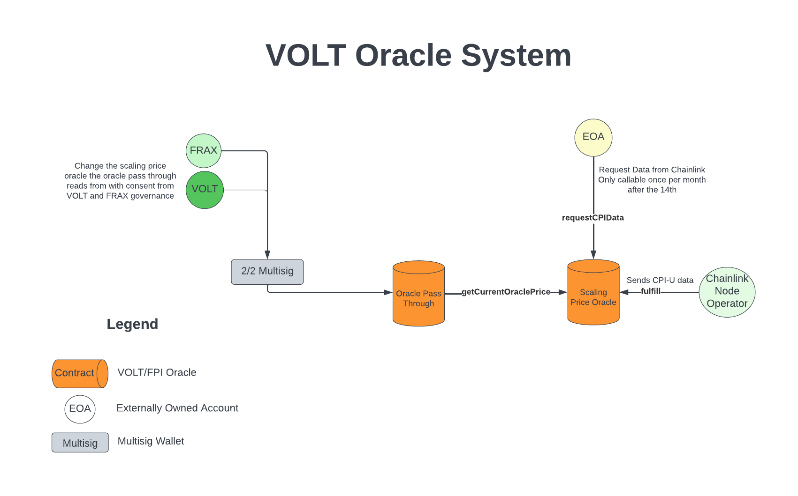

# VOLT Protocol System Architecture

## System Components and Architecture

The VOLT system is forked from the FEI protocol codebase and leverages FEI protocol's code as it is audited and battle tested. FEI is pegged to a dollar and thus does not need an oracle to determine the current price of FEI. The reason the FEI system doesn't need an oracle for its own price is because from the system's perspective, 1 FEI equals 1 USD. Because VOLT is not pegged to a dollar, but rather the purchasing power of the dollar. If there is inflation, then the price of VOLT will increase over time to preserve purchasing power. To support this change in the oracle price over time, there is a custom oracle system which has been built to support this use case.

From a high level, the oracle system reads in CPI data from chainlink, and then increases the system price for VOLT over the next month according to the previous month's data. As an example, if VOLT launched at the start of the current month at $1 and the previous month's inflation was 1%, then the price of VOLT at the end of the current month would be $1.01.

The oracle system reads data in from chainlink, calculates the percentage change in prices from last month to the current month in basis points, then that data is stored and linearly interpolated over the course of the next 28 days. The reason 28 days was chosen as a timeframe to interpolate changes over is because it is the shortest month, so even during February, there will be no issues with changes being interpolated over a longer or shorter time period than is available before the next monthly change rate.

### Notes On LERP
The 28 day linear interpolation timeframe leaves the possibility for the price to not increase for 1-3 days after the change has finished interpolating. This could cause an increase in VOLT borrow demand during that period of time as the cost of inflation does not exist for borrowers during this window. Alternative solutions have been evaluated, however, it is not clear that these solutions are strictly better as there are likely tradeoffs such as increased gas costs for reading the VOLT price from the oracle. This issue of increased borrow demand for a short period of time is only exploitable by users with a large bankroll that are trying to get leverage for a very short period of time, and are not selling and buying back the VOLT as the trading fees would likely eat into any cost savings. This cost savings would be equivalent to 6 basis points, which is small enough to ignore.

## VOLT System Architecture 

## Oracle System

The VOLT Oracle System consists of two contracts. The first is the ScalingPriceOracle, which receives the monthly inflation data from Chainlink, and then applies that change with a linear interpolation over a 28 day timeframe. This contract is ungoverned and immutable. This contract outputs the system redemption price. The next contract is the Oracle Pass Through, which stores a reference to the ScalingPriceOracle and passes all calls for the current oracle price through to the ScalingPriceOracle. The Oracle Pass Through is governed by a 2/2 multisig that has both VOLT and FRAX on it so that both respective teams must agree on any change to the ScalingPriceOracle before those changes can go into effect.
The Peg Stability Module and all fuse oracles will pull price data from the ScalingPriceOracle through a pass through contract called the OraclePassThrough contract. The Oracle pass through contract will pull data directly from the ScalingPriceOracle and is in place so that Fuse Oracles and the Peg Stability Module do not need governance actions to upgrade their oracle if logic is changed in the underlying ScalingPriceOracle.

## VOLT Oracle Architecture 

## Scaling Price Oracle
Immutable contract that can only receive Chainlink CPI data and linearly apply the change over 28 days. This is a non governable contract.

This contract receives the change rate in basis points from a request to Chainlink for CPI data and then smoothly applies that change to the VOLT target price over the course of 28 days. The price is linearly interpolated in basis point terms from the start of the period until 28 days in. Once new data comes in from the Chainlink CPI Oracle, the price compounds the previous month's changes which most accurately represents how the CPI works as changes over time compound to exponentially increase prices in the real economy.

Algorithm for determining the change rate in basis points from the previous month to this month:
`(current month CPI - previous month CPI) / previous month CPI`

The price of VOLT will start at $1 when the system goes live. Over time, changes in the price will compound assuming there is inflation. The price compounding in this contract works through a single variable in the contract called `oraclePrice` which starts off at 1e18, which is really just 1 scaled up by 18 decimals. Then, over the course of the month, the price increases by the percentage it was told to increase by the Chainlink CPI Oracle. At the start of the new period when the Chainlink CPI Oracle calls in to update the price, the `oraclePrice` variable is set to the result of the algorithm, which if the inflation rate over the last month was 1%, and the month's starting price was 1e18, the `oraclePrice` variable will get set to 1.01e18 once the function _oracleUpdateChangeRate is called in the ScalingPriceOracle.

**Algorithm**: `current price + current price * monthly change / 10_000 * Min(seconds passed since last update, 28 days) / 28 days`

The Scaling Price Oracle will be funded with 10 LINK every month by the VOLT team and is a public good.

## Oracle Pass Through
This contract contains a pointer to the ScalingPriceOracle contract and contains two method which exposes the price by calling the ScalingPriceOracle and returning the current system target price. One method `read` turns the ScalingPriceOracle's price into a decimal for backwards compatibility with the OracleRef contract and the `getCurrentOraclePrice` contract returns the current ScalingPriceOracle price as a uint256 scaled up by 1e18.

With the approval of both VOLT and FRAX governance, the address of the ScalingPriceOracle can be updated so if the model for how new CPI data is interpolated over time needs to be changed, that contract can be seamlessly switched out without affecting the VOLT or FPI system with downtime or lengthy governance votes to upgrade all components that rely on the system target price.

## Global Rate Limited Minter
The Global Rate Limited Minter contract is built to handle rate limited minting of VOLT and tightly control access to the minter role. With this contract, only the GlobalRateLimitedMinter will have the minter role and thus significantly reduces the attack surface of the VOLT protocol to within this contract's limits and logic. The Global Rate Limited Minter allows governance to add whitelisted addresses and specify the parameters for their minting. The two parameters for each new address are the Buffer Cap which is the maximum amount of VOLT that an address can mint at a time, and the Rate Limit Per Second by which that address will replenish its buffer. These parameters can be changed by governance and will determine the speed at which PSM VOLT enters circulation.

## Non Custodial Peg Stability Module

The Non Custodial Peg Stability Module (PSM) is a contract which allows exchange of VOLT at the redemption price for the underlying assets with a fee. All PSM pairs will be VOLT and a Stablecoin.
 * `mint()` - buy VOLT with a stablecoin at current redemption price plus a fee
 * `redeem()` - sell VOLT back to the protocol for the current redemption price

The Non Custodial Peg Stability Module is forked off of TRIBE DAO's implementation of the Peg Stability module. The main differences in VOLT's PSM is that it is non custodial, meaning it does not custody any PCV itself, rather, it atomically deposits all proceeds from selling VOLT into the FEI Fuse PCV Deposit. This allows the VOLT protocol to continually accrue interest from PCV and have no opportunity cost of capital sitting idly in the Peg Stability Module.

The Non Custodial Peg Stability Module allows minting through the Global Rate Limited Minter by calling out and minting when it does not have a sufficient VOLT balance.

## Fuse PCV Deposits

There are two Protocol Controlled Value deposits into Fuse. The first is FEI denominated and all PCV FEI will be deposited into this contract. When users sell their VOLT to the PSM, the PSM pulls FEI from this fuse deposit and exchanges it for VOLT. When users buy VOLT, all FEI proceeds are deposited into this PCV deposit and lent out. The second deposit is denominated in VOLT. All VOLT that exists as debt to the system will be VOLT that has been minted into this PCV deposit.

## Audits

VOLT has undergone extensive internal review within the TRIBE DAO and has undergone an audit from Zellic. Code4rena and Spearbit audits are pending.

## Whitepaper
VOLT Protocol [Whitepaper](https://github.com/volt-protocol/whitepaper/blob/main/volt.md)

## Dependencies
 Note that this has only been tested on Linux; you may encounter issues running on other operating systems.
 
 - Node v12 or v16 (you can manage Node versions easily with [NVM](https://github.com/nvm-sh/nvm))
 - Foundry

## Installation
 - run `npm install` in the root directory
 - curl -L https://foundry.paradigm.xyz | bash && foundryup

## Usage
 - run `npm run test` to run forge unit tests
 - run `npm run test:integration` to run forge integration tests
 - run `npm run test:hardhat` to run hardhat unit tests
 - run `npm run test:all` to run all tests
 - run `npm run lint` to lint ts files and sol files
 - run `npm lint:all` to lint ts AND js files
 - run `npm run lint:sol` to lint .sol files
 - run `npm run lint:fix` to fix linting errors, if fixable automatically
 - run `npm run prettier:ts` to run prettier and automatically format all ts files
 automatically
 - run `npm run prettier:sol` to run prettier and automatically format all Solidity files
 automatically
 - run `npm run prettier` to run prettier and format all files
 - run `npm run coverage:hardhat` to run smart-contract coverage based off of all tests
 - run `npm run calldata` to generage calldata for a proposal
 - run `npm run check-proposal` to run tests for a specific dao proposal
 - run `npm run compile` to compile smart contracts, if needed

