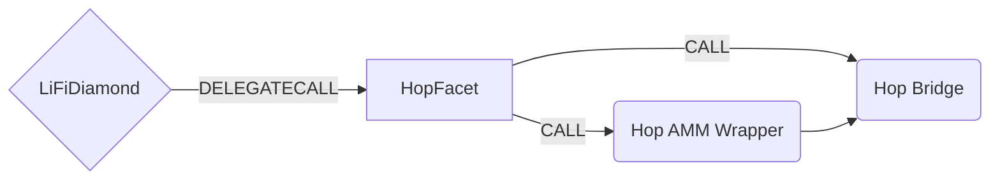

# Hop Facet

## How it works

The Hop Facet works by forwarding Hop specific calls to the [Hop Bridge contract](https://github.com/hop-protocol/contracts/blob/master/contracts/bridges/L2_Bridge.sol). Hop works by swapping tokens into intermediate **h** tokens before bridging. For example to send **USDC** from one chain to another, we need to swap **USDC** for **hUSDC** and then send them to the Hop bridge contract. Hop provides a useful [wrapper contract](https://github.com/hop-protocol/contracts/blob/master/contracts/bridges/L2_AmmWrapper.sol#L40) to do this for us so we only need to worry about sending **USDC** and calling [`swapAndSend`](https://github.com/hop-protocol/contracts/blob/3747b0b41defddc5b3c8ca328057847cd987c2c8/contracts/bridges/L2_AmmWrapper.sol#L40-L78) on the wrapper. Native tokens like **ETH** can be sent directly to the bridge.



## Public Methods

- `function initHop( string[] memory _tokens, IHopBridge.BridgeConfig[] memory _bridgeConfigs, uint256 _chainId)`
  - Initializer method. Sets chainId,Hop bridge and Hop wrapper contracts for the specific chain
- `function startBridgeTokensViaHop(LiFiData memory _lifiData, HopData calldata _hopData)`
  - Simply bridges tokens using Hop
- `function swapAndStartBridgeTokensViaHop( LiFiData memory _lifiData, LibSwap.SwapData[] calldata _swapData, HopData memory _hopData)`
  - Performs swap(s) before bridging tokens using Hop

## Hop Specific Parameters

Some of the methods listed above take a variable labeled `_hopData`. This data is specific to Hop and is represented as the following struct type:

```solidity
/**
 * @param asset The symbol of the asset token being bridged. E.g. USDC.
 * @param recipient The address of the token recipient after bridging.
 * @param chainId The chainId of the chain to bridge to.
 * @param amount The amount of tokens to bridge.
 * @param bonderFee The amount to pay bonders for facilitating the bridge.
 * @param amountOutMin The minimum acceptable amount of hTokens to receive after swapping via the wrapper.
 * @param deadline The time the transaction must be completed or revert.
 * @param destinationAmountOutMin The minimum acceptable amount of tokens to receive after bridging.
 * @param destinationDeadline The time the transaction must be completed or revert.
 */
struct HopData {
  string asset;
  address recipient;
  uint256 chainId;
  uint256 amount;
  uint256 bonderFee;
  uint256 amountOutMin;
  uint256 deadline;
  uint256 destinationAmountOutMin;
  uint256 destinationDeadline;
}

```

## Swap Data

Some methods accept a `SwapData _swapData` parameter.

Swapping is performed by a swap specific library that expects an array of calldata to can be run on variaous DEXs (i.e. Uniswap) to make one or multiple swaps before performing another action.

The swap library can be found [here](../src/Libraries/LibSwap.sol).

## LiFi Data

Some methods accept a `LiFiData _lifiData` parameter.

This parameter is strictly for analytics purposes. It's used to emit events that we can later track and index in our subgraphs and provide data on how our contracts are being used. `LiFiData` and the events we can emit can be found [here](../src/Interfaces/ILiFi.sol).

## Getting Sample Calls to interact with the Facet

In the following some sample calls are shown that allow you to retrieve a populated transaction that can be sent to our contract via your wallet.

All examples use our [/quote endpoint](https://apidocs.li.finance/reference/get_quote-1) to retrieve a quote which contains a `transactionRequest`. This request can directly be sent to your wallet to trigger the transaction.

The quote result looks like the following:

```javascript
const quoteResult = {
    "id": "0x...",           // quote id
    "type": "lifi",          // the type of the quote (all lifi contract calls have the type "lifi")
    "tool": "hop",           // the bridge tool used for the transaction
    "action": {},            // information about what is going to happen
    "estimate": {},          // information about the estimated outcome of the call
    "includedSteps": [],     // steps that are executed by the contract as part of this transaction, e.g. a swap step and a cross step
    "transactionRequest": {  // the transaction that can be sent using a wallet
        "data": "0x...",
        "to": "0x...",
        "value": "0x00",
        "from": "{YOUR_WALLET_ADDRESS}",
        "chainId": 100,
        "gasLimit": "0x...",
        "gasPrice": "0x..."
    }
}
```

A detailed explanation on how to use the /quote endpoint and how to trigger the transaction can be found [here](https://apidocs.li.finance/reference/how-to-transfer-tokens).

**Hint**: Don't forget to replace `{YOUR_WALLET_ADDRESS}` with your real wallet address in the examples.

### Cross Only
To get a transaction for a transfer from 1 USDT on Gnosis to USDT on Polygon you can execute the following request:
```shell
curl 'https://li.quest/v1/quote?fromChain=DAI&fromAmount=1000000&fromToken=USDT&toChain=POL&toToken=USDT&slippage=0.03&allowBridges=hop&fromAddress={YOUR_WALLET_ADDRESS}'
```

### Swap & Cross
To get a transaction for a transfer from 1 USDT on Gnosis to USDC on Polygon you can execute the following request:
```sh
curl 'https://li.quest/v1/quote?fromChain=DAI&fromAmount=1000000&fromToken=USDT&toChain=POL&toToken=USDC&slippage=0.03&allowBridges=hop&fromAddress={YOUR_WALLET_ADDRESS}'
```
