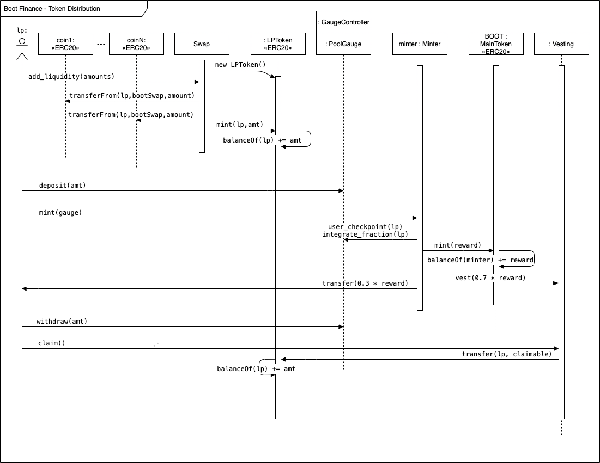

# Boot Finance contest details
- $47,500 USDC main award pot
- $2,500 USDC gas optimization award pot
- Join [C4 Discord](https://discord.gg/code4rena) to register
- Submit findings [using the C4 form](https://code423n4.com/2021-11-boot-finance-contest/submit)
- [Read our guidelines for more details](https://docs.code4rena.com/roles/wardens)
- Starts November 4, 2021 00:00 UTC
- Ends November 10, 2021 23:59 UTC

## 👢 Introduction

Boot Finance is a project focused AMM that aims to let projects control their own liquidity, with the eventual goal of being the primary AMM/DEX for the majority of projects in DeFi.

As the majority of DeFi infrastructure moves to L2s over the coming months/years, the existing DEX/AMM ecosystem will be disrupted.
It’s the thesis of Boot Finance that the current AMM dex landscape with one-size fits all solutions cannot persist as projects move to L2s. As gas costs reduce, there is reduced need for massive single source liquidity pools(the main competitive metric right now in DEXes), as arb bots can inexpensively arb the price across multiple liquidity sources. Many projects will want both the advantages of custom AMMs that provide features/parameters that are governed by the project itself, along with the ability to manage their LP positions in traditional DEXes across the entire EVM L2 landscape.

Boot Finance introduces the novel [CustomSwap](https://blog.boot.finance/customswap-by-boot-finance-1336f6d63cbd) algorithm that allows projects to more granularly control their price movements, and avoid sudden liquidity shocks. The detailed litepaper can be found [here](https://www.slideshare.net/sabretooth1/boot-finance-litepaper-v053pdf).

## 📄 Contracts
### 🔍 Scope
```
.
  | - customswap
  |  | - contracts                                <Contracts from Saddle codebase; heavily modified and need most attention>                
  |  |  | - MathUtils.sol                         [47]    #Library
  |  |  | - Swap.sol                              [697]	  #Swap - Main Swap Contract
  |  |  | - SwapUtils.sol                         [1763]	#Library - Contains supporting logic for Swap.sol
  | - vesting
  |  | - contracts
  |  |  | - AirdropDistribution.sol               [611]	#Airdrop Distribution - Distributes airdrop allocated to Swerve participants
  |  |  | - InvestorDistribution.sol              [218]	#Investor Distribution - Distributes allocations to Angel & Seed round contributors
  |  |  | - Vesting.sol                           [216]	#Vesting Contract - This is critical - 70% of all token emissions are locked here
  | - tge
  |  | - contracts                                <Contracts from Vether(vetherasset.io) Code Base; modified to enable NFT-gated TGE>
  |  |  | - PublicSale.sol                        [314]	#TGE Contract - Based on Vether4.sol from VetherAsset codebase
  |  |  | - PublicSaleBatchWithdraw.sol           [40]	#Batch Withdraw - Withdraw tokens for all weeks and days at once
```
The codebase of Boot Finance is a combination of Curve/Swerve/Saddle/Vether codebases, with native pools borrowing from Curve/Swerve, CustomSwap Pools relying on Saddle, and Vether being utilized for TGE.

The Curve/Swerve code-bases have had multiple audits and hence are excluded from the scope of this specific audit, but are included for reference to how the larger set-up works.

All emissions are in line with the standard [token emission schedule](https://docs.google.com/spreadsheets/d/16aZznOquMsZnx1nz31RQQ6gtMfxiiSuSrVDA19srbBs/edit#gid=1421541501).

#### 📄 Swap.sol [697]
This is the main swap contract from Saddle codebase that relies on Math and Swap Utils libraries. The swap logic has been modified to allow pricing with the use of multiple curves instead of a singular price curve. At a `targetprice` the curve being used switches, this allows flexibility to choose multiple A factors that can be in effect depending on the price. ie use A = X at price < Z, use A = Y at price > Z.

#### 📄 AirdropDistribution.sol [611]
10% of all $BOOT DAO tokens will be distributed to Swerve Active Governance Participants based on a snapshot taken earlier, this contract handles the distribution of tokens for airdrop eligible participants.

#### 📄 InvestorDistribution.sol [218]
Boot had a small angel, and then a seed round. The distribution for that allocation is handled by this contract.

#### 📄 Vesting.sol [216]
All boot emissions, regardless of entity are subject to a standard 12-month vesting for 70% of their eligible tokens, ie. LP claims X tokens 30% is instantly transferred out, 70% is locked on their behalf in the vesting contract which can be claimed linearly over the next 12 months.

#### 📄 PublicSale.sol [314]
TGE for distribution of public allocation based on [Vether](https://www.vetherasset.io). For the first four weeks, only NFT holders can participate in the public TGE.

### 📎 Additional Suppporting Information


Note: Allocations for distribution contracts are pre-minted and funded to the contract to manage.

---


[Discord](https://discord.gg/hNnvEq3U)

[Twitter](https://twitter.com/bootfinance)

[Wesbite](https://boot.finance)

[Telegram](https://t.me/bootfinance)

[Medium](https://blog.boot.finance/)
