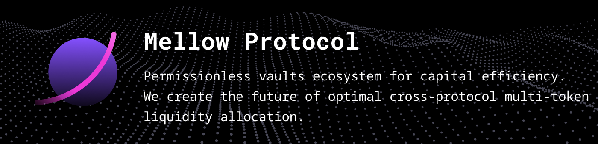

## Mellow Vaults




**We're buliding permissionless vaults ecosystem for trustless automatic DeFi strategies.
The protocol is designed for implementing multi-token cross-protocol liquidity rebalancing.**

The Vault contracts hold the tokens and rebalance them both inside other protocols and between them. Strategy contracts interact with Vault contracts definig the rebalancing parameters.

**Liquidity provider**
Users pick a strategy that fits their needs and allocate their assets into a vault to earn yield. When the assets are deposited, users get composable LP tokens (ERC-20).

**Strategies**
Strategies are smart-contracts that implement the models to provide effective liquidity allocation. Different market events can trigger the strategies to initiate rebalance.

**Vaults**
Vaults allocate multiple ERC-20 tokens into other DeFi protocols and rebalance the liquidity in accordance with Strategies inside and between the protocols.

## Docs

[Vaults design article](https://mellowprotocol.medium.com/mellow-protocol-vaults-design-ed09bed7b869) – protocol design overview (A Medium article)

[Protocol documentation](https://docs.mellow.finance/) – the most complete information about the contracts

## Run unit tests

Required env variables (could be addred to `.env` file):

```
MAINNET_RPC=<ethereum rpc endpoint>
KOVAN_RPC=<ethereum rpc endpoint>
```

MAINNET_RPC should be able to serve acrhive node api. E.g. [Alchemy](https://www.alchemy.com/) can do that.

```bash
yarn
yarn coverage
```

**Tests coverage report**

```bash
open coverage/index.html
```

## Run property tests (WIP)

```bash
yarn global add ganache-cli
cd test_brownie
python3 -m virtualenv venv
source venv/bin/activate
pip install -r requirements.txt
brownie test
```

## Deploy

Required env variables (could be added to `.env` file):

```
MAINNET_RPC=<ethereum rpc endpoint>
KOVAN_RPC=<ethereum rpc endpoint>
MAINNET_DEPLOYER_PK=0x.... # for mainnet deploy
KOVAN_DEPLOYER_PK=0x.... # for kovan deploy
```

```bash
yarn
yarn deploy:hardhat
# or yarn deploy:kovan
# or yarn deploy:mainnet
```

## Check contract size

```bash
yarn
yarn size
```
