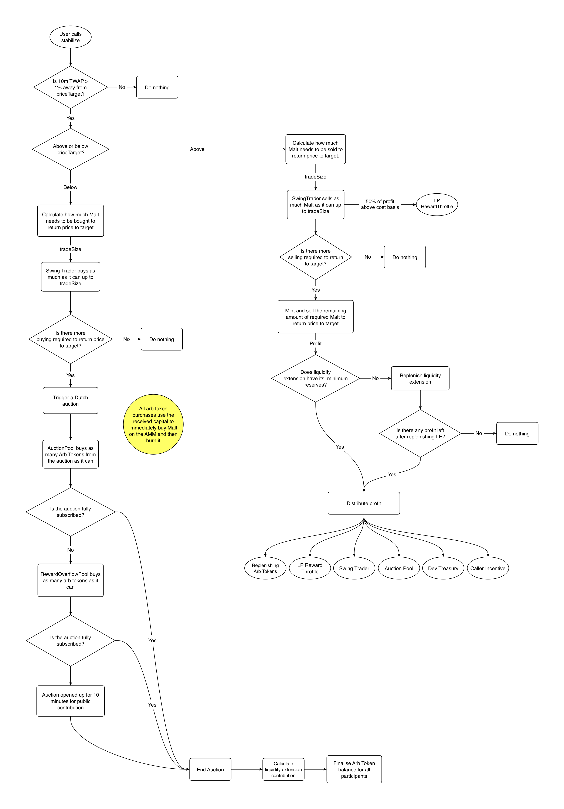
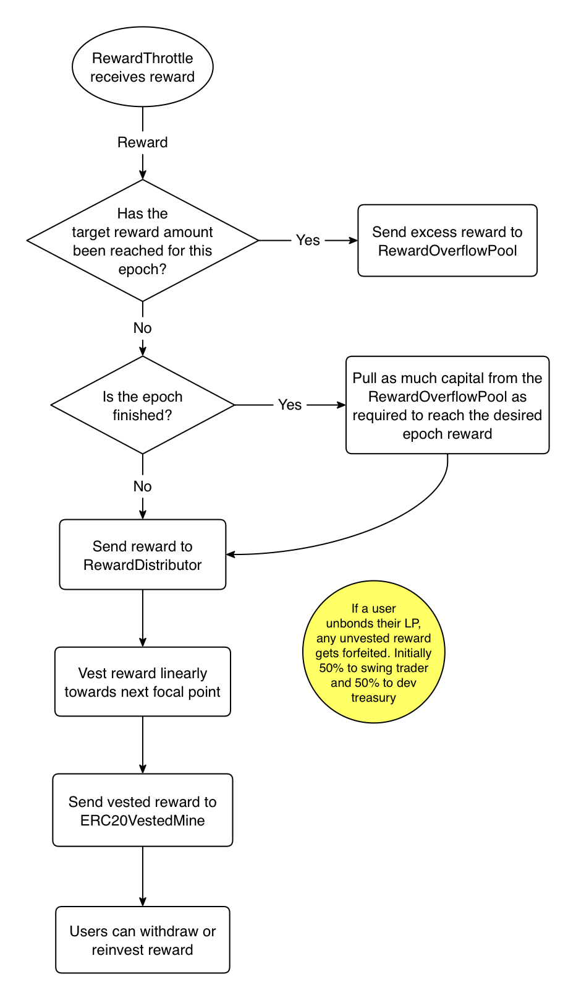
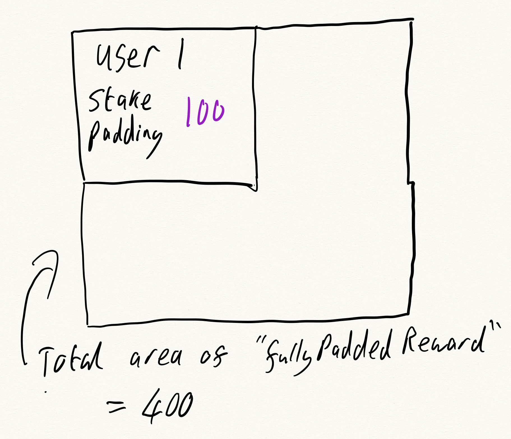
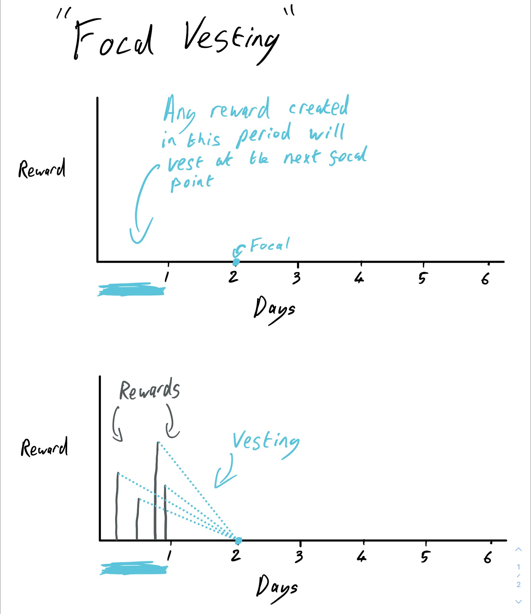
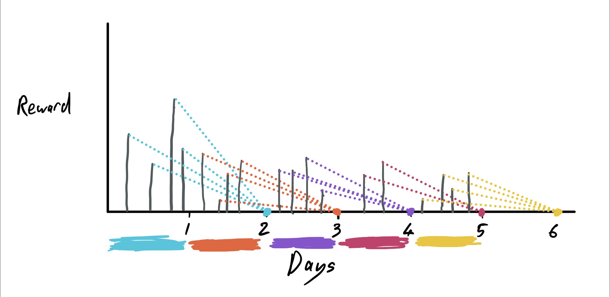

# Malt Finance contest details
- $64,000 USDC main award pot
- $4,000 USDC gas optimization award pot
- Join [C4 Discord](https://discord.gg/code4rena) to register
- Submit findings [using the C4 form](https://code4rena.com/contests/2021-11-malt-finance-contest/submit)
- [Read our guidelines for more details](https://docs.code4rena.com/roles/wardens)
- Starts November 25, 2021 00:00 UTC
- Ends December 1, 2021 23:59 UTC

### Contact us
Discord handles to contact with questions about the protocol and their timezones:
* 0xScotch#6626 (GMT) (lead dev, ask anything)
* FelipeDlB#9359 (GMT-3) (non-technical but very knowledgeable about core mechanics)

[You are also welcome to join our discord](https://discord.gg/cqQXnYmvdt) (Let us know your handle and we will give you a special role for helping us out with security)

## Index
* [High level overview of the Malt protocol](#high-level-overview-of-the-malt-protocol)
* [Testnet](#testnet)
* [Glossary Of Terms](#glossary-of-terms)
* [Contract Scope Overview](#contract-scope-overview)
* [Description of each contract in scope](#description-of-each-contract-in-scope)
* [Technical Notes](#technical-notes)
* [Known Issues / trade offs](#known-issues--trade-offs)

## High level overview of the Malt protocol
The goal of Malt is to maintain the price of the Malt token at $1 per Malt.

When the price of Malt rises to above $1 per coin the protocol mints brand new Malt and sells it. That sell pressure drops the price back to $1. When the protocol sells the Malt it receives other tokens (DAI for example) which are all profit for the protocol as the protocol simply minted the coins it sold.

A portion of the profit received is simply redistributed to everyone who is invested in Malt (liquidity providers). The rest of the profit is held back by the protocol.

When Malt's price falls below $1, then the profit that was held back from the mechanism explained above is used to buy back Malt to increase the price back to $1 again.

If the retained profit is not enough to return the price to $1 then an auction is triggered where any user can commit money to the protocol to help return the price to $1. In return for their commitment, these users receive "Arbitrage Tokens" which carry a premium above their commitment which is redeemable in the future for $1. Concretely, if a user commits $100 to help they may receive 120 Arbitrage tokens which can be redeemed for $1 each in the future.

## Testnet
[Have a look at the protocol in action on the polygon mumbai testnet](https://matictestnet.stablemalt.finance/faucet)

## Glossary Of Terms

| Term                          | Definition                  |
| ----------------------------- | --------------------------- |
| Epoch                         | A 30 minute window used for APR accounting |
| Liquidity Extension           | A pool of capital used to facilitate offering a premium to participants in the Arbitrage Auctions  |
| Arbitrage Auction             | A dutch auction mechanism to raise capital to defend Malt's peg. An auction is used to allow price discovery on the premium for the risk of helping defend peg |
| Reserve Ratio                 | The ratio of capital in the Liquidity Extension pool vs the Malt in the AMM pool the Liquidity Extension is attached to |
| True Epoch APR                | The APR implied by total protocol profit in a given epoch against the average total value of bonded LP in that epoch |
| Desired Epoch APR             | The target APR the protocol is aiming for in a given epoch. This is some % of the 24 hour moving average of True Epoch APR. The default value is 20%. IE if the average True Epoch APR over the last 24 hours is 200% then the Desired Epoch APR for that epoch will be 40% |
| Implied Collateral            | The sum of capital sources that could be pulled upon to defend peg. Many of these sources are not purely serving the purpose of being collateral. Eg `RewardOverflowPool` is capital set aside to make up the difference in reward on epochs where desired APR isn't met. However, under peg some of this capital can be redirected to defend peg. More discussion on implied collateral below. |
| Swing Trader                  | This is a contract which privileged access whose role is to defend peg with capital and attempt to profit from Malt's price movements (thus increasing collateral over time). |
| Malt Data Lab                 | An internal oracle service that tracks moving averages of many useful internal streams of data (price, reserve ratio, AMM pool reserves etc) |
| Reward Throttle               | The contract that throttles an epoch's True APR to the Desired APR by either pushing or pulling capital to/from the `RewardOverflowPool` |
| Reward Overflow               | A pool of capital that is topped up when an epoch naturally reaches it's Desired APR. The overflow is depleted when an epoch fails to reach it's Desired APR. This pool can be thought of as a smoothing mechanism that takes excess profit from high activity epochs to subsidize APR in low activity epochs. |
| Reward Distributor            | The contract in charge of implementing the focal vesting scheme. It receives capital from the `RewardThrottle` and then vests it according to the focal scheme. A `vest` method can be called on this contract at any time and it will calculate how much reward has vested since the last call and send that capital to the `ERC20VestedMine` ready for user's to withdraw / reinvest it. |
| Focal Vesting                 | The scheme used to distribute rewards to bonded LPs. Rewards vest linearly towards the next "focal point". This means all rewards created in a certain period will vest towards the same point, making calculations significantly easier. The focal points are set by default such that the minimum vesting period is 24 hours and the maximum is 48hours (with a 24 hour catchment). More on this later. |

## Contract Scope Overview

| Contract Name                          | Lines of Code | Link to source           |
| -------------------------------------- | ------------- | -------------- |
| `AbstractRewardMine.sol`               | 185           | [AbstractRewardMine.sol](src/contracts/AbstractRewardMine.sol) |
| `AuctionBurnReserveSkew.sol`           | 139           | [AuctionBurnReserveSkew.sol](src/contracts/AuctionBurnReserveSkew.sol) |
| `AuctionEscapeHatch.sol`               | 174           | [AuctionEscapeHatch.sol](src/contracts/AuctionEscapeHatch.sol) |
| `AuctionParticipant.sol`               | 95            | [AuctionParticipant.sol](src/contracts/AuctionParticipant.sol) |
| `AuctionPool.sol`                      | 123           | [AuctionPool.sol](src/contracts/AuctionPool.sol) |
| `Auction.sol`                          | 750           | [Auction.sol](src/contracts/Auction.sol) |
| `Bonding.sol`                          | 252           | [Bonding.sol](src/contracts/Bonding.sol) |
| `DAO.sol`                              | 90            | [DAO.sol](src/contracts/DAO.sol) |
| `DexHandlers/UniswapHandler.sol`       | 242           | [UniswapHandler.sol](src/contracts/DexHandlers/UniswapHandler.sol) |
| `ERC20VestedMine.sol`                  | 80            | [ERC20VestedMine.sol](src/contracts/ERC20VestedMine.sol) |
| `LiquidityExtension.sol`               | 125           | [LiquidityExtension.sol](src/contracts/LiquidityExtension.sol) |
| `MaltDataLab.sol`                      | 222           | [MaltDataLab.sol](src/contracts/MaltDataLab.sol) |
| `Malt.sol`                             | 53            | [Malt.sol](src/contracts/Malt.sol) |
| `MiningService.sol`                    | 139           | [MiningService.sol](src/contracts/MiningService.sol) |
| `MovingAverage.sol`                    | 300           | [MovingAverage.sol](src/contracts/MovingAverage.sol) |
| `Permissions.sol`                      | 117           | [Permissions.sol](src/contracts/Permissions.sol) |
| `PoolTransferVerification.sol`         | 92            | [PoolTransferVerification.sol](src/contracts/PoolTransferVerification.sol) |
| `RewardReinvestor.sol`                 | 119           | [RewardReinvestor.sol](src/contracts/RewardReinvestor.sol) |
| `RewardSystem/RewardDistributor.sol`   | 250           | [RewardDistributor.sol](src/contracts/RewardSystem/RewardDistributor.sol) |
| `RewardSystem/RewardOverflowPool.sol`  | 58            | [RewardOverflowPool.sol](src/contracts/RewardSystem/RewardOverflowPool.sol) |
| `RewardSystem/RewardThrottle.sol`      | 228           | [RewardThrottle.sol](src/contracts/RewardSystem/RewardThrottle.sol) |
| `StabilizerNode.sol`                   | 421           | [StabilizerNode.sol](src/contracts/StabilizerNode.sol) |
| `SwingTrader.sol`                      | 129           | [SwingTrader.sol](src/contracts/SwingTrader.sol) |
| `TransferService.sol`                  | 69            | [TransferService.sol](src/contracts/TransferService.sol) |
| **Total**                              | **4452**      |  |

*All lines of code were counted using `cloc` tool on linux. Only lines of code are counted, not blanks / comments etc*

## Description of each contract in scope

### AbstractRewardMine
This is an abstract class that contains the core functionality for tracking the rewards for a set of bonded LPs. It is set up to support independently tracking the total declared reward as well as the total released reward. 

When declared and released are the same, it functions as a straightforward liquidity mine style contract where rewards are divided pro-rata all currently bonded LPs. However, when these values differ it allows for vesting behaviour. The exact behaviour will be defined by the inheriting contract.

In the case of vesting rewards it is desired that a user is only eligible for rewards that where declared (but not vested) before that user bonded their LP. Eg.
  1. User 1 Bonds 100 LP
  2. $100 of rewards are declared
  3. 1 minute later User 2 bonds 100 LP

In this situation, Users 1 and 2 both own 50% of the bonded LP, however User 1 should own all of the declared reward. Although almost none of that reward is vested yet (only 1 minute into the vesting period). The contract uses what we call `stakePadding` (discussed in more detail below) to keep track of this ownership.

In the Malt codebase there are two contracts that inherit from `AbstractRewardMine`. They are:
* `ERC20VestedMine`
* `AuctionPool`

The main methods for returning reward balances are:
* `balanceOfRewards(address)` - returns total rewards allocated to that address (these rewards are not necessarily available yet as is the case with vesting)
* `earned(address)` - the current balance of rewards that are fully vested and ready to withdraw / reinvest.

### AuctionBurnReserveSkew
This contract is used at the end of an arbitrage auction to decide how much the liquidity extension should skew towards burning Malt to contract supply vs maintaining supply and retaining capital in the liquidity extension contract.

It takes into consideration how frequently the price of Malt has been stabilized above vs below the peg and how subscribed the previous auctions have been.

If the price has been stabilized from above peg more frequently and auctions are fully subscribed in recent history then the contract will decide to burn more supply. If price spends more time below peg and the auctions are less subscribed then the contract will be more conservative and try to retain capital where possible.

### AuctionEscapeHatch
When a user participates in an auction they are effectively buying a binary option on Malt returning to peg. If Malt never recovers they suffer a 100% loss as the arb tokens are worthless until they are redeemed. If Malt does recover and the arb tokens are redeemed then the user gets the fully premium of the arb tokens. This is an undesirable risk profile.

To mitigate the binary nature of this, the `AuctionEscapeHatch` contract allows users to exit their arbitrage token position early. 

When a user purchases arb tokens, their capital is used to buy Malt. The price paid for the Malt is tracked. This price paid is the set point by which early exists are judged (as opposed to the dutch auction price paid).

If the current Malt market price is below the Malt price paid by a user in an auction then the user can exit at the loss (ie their Malt purchase price was $0.90 and the current market price is $0.80, then they can accept a $0.10 loss per arb token).

If the current Malt market price is above their Malt purchase price they can exit at 20% (configurable) of the trade's profit. IE if they got in at a Malt price of $0.8 and the current price is $0.9 then they can exit at $0.82.

This system is meant to encourage users to hold for the full profit while giving them the flexibility to control their risk a little better than a pure binary option.

### AuctionParticipant
The `AuctionParticipant` contract is meant to be inherited by other contracts and provides the ability for the contract to participate in auctions. It can use capital the contract has to purchase arbitrage tokens and redeem them when available.

In the current Malt system there are 2 contracts that leverage the AuctionParticipant:
1. `AuctionPool` - uses capital to purchase arb tokens which are then pro-rata claimable by bonded LPs when the tokens are redeemed.
2. `RewardOverflowPool` - uses funds in the overflow to purchase arb tokens and all profit from arb tokens is just retained by the overflow pool to fund future reward underflows.

### AuctionPool
A portion of above peg profit is directed to the `AuctionPool` contract. This capital is then used to automatically participate in the auctions (using the `AuctionParticipant`) and the revenue received from redeeming those auction arbitrage tokens is then distributed pro-rata to LPs.

This pool can be thought of as regular LP reward except the capital has to be used in an auction (and thus it also grows by the auction premium) before the user is allowed to withdraw / reinvest it.

The `AuctionPool` sows the seed of implied collateral. The capital in this contract is allocated for user rewards but before it can be distributed to users as rewards it must act as collateral to defend peg. This multiple simultaneous use cases for the capital is the basis of implied collateral.

### Auction
The core contract that implements all the logic required for the dutch auctions. Auctions are triggered by the `StabilizerNode` whenever the price of Malt falls below the peg price.

This contract handles purchasing arb tokens, redeeming them pro-rata in auction order (ie auction 0 gets fully filled before auction 1 gets any) and users claiming available tokens.

### Bonding
The core contract that user's bond their LP into. It stores all the LP and keeps track of each user's bonded amount. It calls `onBond` and `onUnbond` hooks on the `MiningService` which then alerts all reward sources (inheritors of `AbstractRewardMine`) so each source can correctly track each user's ownership of its respective reward pool.

The two main methods on this contract are `bond` and `unbond`.

### DAO
The main goal of this contract in the current system is keeping track of the current epoch. It has an `advance` method to tick the epoch over and all other contracts lean on this one if they need to know the current epoch.

### UniswapHandler
A helper contract that allows other contracts to easily interact with UniswapV2 style AMMs. Each Malt pool will have it's own handler.
* Buying Malt
* Selling Malt
* Adding liquidity
* Removing liquidity
* Fetching live data from the pool

### ERC20VestedMine
The core reward source for bonded LPs. It inherits from `AbstractRewardMine` and works closely with the `RewardDistributor` to implement the reward vesting seen in Malt. More on this interaction below.

### LiquidityExtension
The core goal of this contract is to facilitate the auction premium without net supply inflation after the premium has been paid off. The amount of "arb tokens" the user receives from the auction is determined by the final price of the auction (reached either at the end of the allotted time or when the auction is fully subscribed). Each arb token is worth $1 (in DAI initially) when Malt is back to peg and above peg profit pays down the tokens.
This process implies that each arb token is worth 1 Malt when at peg. During the auction, all capital committed to the auction is used to buy Malt from the AMM and burn it. At the end of the auction it is known how many arb tokens have been created and how much Malt was burned. If less Malt has been burned than arb tokens created then that implies a required supply growth to pay down the tokens.
Therefore, the protocol will endeavour to burn at least as much Malt as it creates arb tokens. This is the job of the liquidity extension. It can also choose burn more (which is where the `AuctionBurnReserveSkew` contract comes in) to see a net contraction of supply.
The contract contains capital and a desired `minReserveRatio`, which is a ratio of capital in the contract against the Malt in the AMM pool the liquidity extension is paired with.
*Note that the "Malt in the pool" in this case isn't the actual Malt in the pool but instead the Malt that should be in the pool given the current value of k in the AMM and the current peg price of Malt.*

### MaltDataLab
This is a contract that is used by all others to fetch data pertaining to the pool being stabilized. It makes use of `MovingAverage` contracts to provide flexibility over the length of time averages are calculated over.

*Note the usage of our own `MovingAverage` is noted in the known issues and trade offs section below.*

### Malt
The ERC20 contract for the Malt token itself. It uses open zeppelin contracts and implements `mint` and `burn` behind timelock permissioning.

The main deviation from a standard OZ ERC20 is the addition of the `transferService.verifyTransfer(from, to, amount)` call on the `_beforeTokenTransfer` hook. This allows some control over what transfers are allowed and which are not. 

In practice the use case for this is to block buying Malt on a given AMM pool when that pool is a certain distance under peg. This is the so called "Recovery Mode" where the under peg mechanics take over to attempt to recover peg.

### MiningService
An abstraction that ties together multiple reward sources (implementations of `AbstractRewardMine`). Each reward source can be registered against the `MiningService` and will then be alerted when a user bonds or unbonds.

This contract also allows calling `balanceOfRewards` and `earned` which will sum the values across all registered reward sources.

### MovingAverage
An implementation that allows for multiple length moving averages to be calculated using a single contract. It is heavily inspired by uniswapV2 `cumulativeValue` implementation for TWAP.

A number of samples and sample length are specified on initialization of the contract and from there calls to `update(uint)` or `updateCumulative(uint)` keep track of all the samples.

It is then possible to make a call to get the average price over any period of time between 1 sample length and the number of sample * sample length.

Concretely, if the contract is set up for a sample length of 30 seconds and 60 samples then you can fetch the moving average of that data source anywhere between 30 seconds and 30 minutes in 30 second increments.

To avoid the ability to manipulate some of these values with flashloan attacks (say for example when tracking pool price) only permissioned addresses are allowed to call `update`.

*A major drawback of this is the requirement to upkeep this contract by calling `update` on a frequent enough cadence. Chainlink keepers will likely be used for this purpose*

### Permissions
This contract is the backbone of the protocol's access control. Almost every contract inherits from the `Permissions` contract which itself inherits from Open Zeppelin's `AccessControl`.

Some roles are implemented directly in the permission contract, but all inheriting contracts are open to define their own.

The permissioning contract also adds emergency withdraw to every Malt contract that is locked down to only the `TIMELOCK_ROLE`. This is done in an attempt to balance between the ability to rescue funds should issues arise in the contracts while avoiding any individual having too much privilege. Now should any reason arise to remove funds from a contract, it is possible, but only via the 2 day timelock.

### PoolTransferVerification
This is a contract that gets called via the `TransferService` when the Malt token is attempting a transfer. There can be many `PoolTransferVerification` contracts used, each with their own custom logic.

They must all contain a `verifyTransfer` method that returns `true` if the transfer should be allowed and `false` if it should be blocked.

### RewardReinvestor
A contract that simplifies the process for a user to reinvest their rewards. It has privileged access to the `MiningService` to be able to withdraw rewards on behalf of a user. It then interacts with `UniswapHandler` to create the LP tokens using the rewarded funds and then bonds that LP into the `Bonding` contract on behalf of the user.

*This contract can almost certainly be improved upon in terms of efficiency as well as edge case handling*

### RewardDistributor
The contract in charge of the vesting schedule for LP rewards. It implements the focal vesting scheme (discussed in the Technical Notes section below).

This contract is not aware of users or their bonded LP. Instead it just receives rewards from `RewardThrottle` and sends them onto `ERC20VestedMine` as they vest.

The main methods on this contract are `declareReward` and `vest`. `declareReward` can only be called by addresses with the `THROTTLER_ROLE` and it just lets the contract know about new rewards. `vest` will calculate how much reward has vested since the last time it was called and send that money to the reward mine.

### RewardOverflowPool
This is where excess above peg profit is kept when the Desired Epoch APR is reached for a given epoch. This capital can then be requested by the throttler contract when a subsequent epoch didn't reach its desired APR.

It is taking money from the rich epochs to give to the poor epochs. Ultimately smoothing out the inherently volatile and unpredictable nature of profit generation in Malt.

### RewardThrottle
In charge of smoothing out the protocol profit that is marked for user rewards. It works in tandem with the `RewardOverflowPool` to smooth out the rewards across epochs. It keeps track of the target APR for any given epoch and will redirect excess capital into the overflow pool and request capital from the overflow pool as needed.

### StabilizerNode
This contract is the "brain" of the stability system in Malt. It has a `stabilize` method that can trigger the protocol to take action towards stabilizing the AMM pool (remember that each AMM pool gets its own stabilizer system).

It uses a 10min TWAP with a 1% deviation threshold to trigger actions. TWAP > 1% above peg will trigger selling Malt (either freshly minted or from swing trader Malt holdings). TWAP > 1% below peg will trigger swing trader purchasing + arbitrage auction.

It also deals with automatic auction participation from `AuctionPool` and `RewardOverflowPool`.

This means when the implied collateral of the system is healthy almost all depeg events should be resolved in the `stabilize` transaction. Only when implied collateral isn't enough will the auction be turned over to the public.

### SwingTrader
Using all of its available power, the swing trader valiantly defends peg. Whenever general `StabilizerNode` informs `SwingTrader` of an opportunity it will jump into action by either using its collateral capital to buy back Malt or by selling the Malt it has available.

The swing trader gets an allocation of above peg protocol profit and that capital is then used to help defend peg. This is done from a privileged position though, as it is whitelisted to be allowed to purchase Malt from the AMM even when everyone else isn't. In doing so, the swing trader profits when peg is regained.

Over time, the aim is that the swing trader will make enough profit to fully collateralize Malt and then protocol parameters can be adjusted to direct more above peg profit to LPs.

### TransferService
This is a contract similar to the `MiningService` that abstracts one or more `PoolTransferVerification` contracts. The `Malt` ERC20 calls `verifyTransfer` on `TranserService` which then relays that call to the correct `PoolTransferVerification` contract(s). If one of these `PoolTransferVerification` calls returns `false` then `TranserService` will return false back to the `Malt` contract which will ultimately revert and block the transfer.

## Technical Notes

### Each supported AMM pool gets its own stabilizer system
Unlike many other stablecoin systems that operate at a global scale, Malt operates on the AMM pool level. Each supported AMM pool gets its own stabilization system. Initially, there will only be a Malt/DAI pool but more will be deployed over time.

Auctions, swing trader, LP rewards, liquidity extension etc are all localized to each AMM pool and have no awareness of other pools. When additional pools are deployed, the pools can "communicate" via price arbitrage across the pools. If one pool loses peg then arbitrage will equalize the one large drop in that pool into a small drop across many pools. This then allows each isolated stability system to deal with a smaller (and hopefully more manageable) deviation, reducing overall stress on the system.

This ability to design locally for a single AMM pool allows for smaller more manageable problems to be tackled rather than attempting to stabilize the token globally.

### Architecture + flow diagrams
This is a diagram of the high level architecture of a single AMM pool stability + reward system (some connections are left out for clarity):

Here is a flow diagram through the decisions made when `stabilize` is called on the `StabilizerNode`.

The following flow diagram illustrates the decision flow in the reward throttling and vesting system.

### The Permissioning system
All contracts inherit from the `Permissions` contract that itself inherits from Open Zeppelin's `AccessControl`. `Permissions` defines some roles and handles initial setup (ensuring timelock and admin have correct access etc). Each contract can additionally define its own roles.

This contract also defines emergency withdraw functionality that only the `TIMELOCK_ROLE` can call. This is done as a layer of protection while still allowing withdrawing the funds in case of genuine reason.

A simple `notSameBlock` modifier also exists here that guards against re-entrancy from the same address. Eg blocking an address from bonding and unbonding in the same tx to avoid flashloan risks.

### Implied collateral
Implied collateral is the term used to describe the way Malt makes use of additional sources of capital as if they are collateral, while they are serving other purposes.

The two main sources of implied collateral are:
* `AuctionPool`
  * This is a pool of above peg protocol profit that is to be allocated to users as rewards. However, before users get access to this capital it must be deployed into an arbitrage auction. Once the DAI -> arb tokens -> DAI cycle has completed then the DAI is rewarded pro-rata to LPs.
* `RewardOverflowPool`
  * This is the pool of capital that is filled via excess rewards above the Desired Epoch APR for a given epoch. This capital's main job is to smooth out variance in rewards from epoch to epoch. So this too is capital that will eventually become user rewards. However, if required, the protocol will use this capital to purchase arb tokens to defend peg, turning the reward capital into a form of collateral.
  * Unlike `AuctionPool` when the arb tokens are redeemed all the profit is retained in the overflow pool, just extending the runway of reward smoothing (and size of implied collateral).

### Recovery Mode (blocking AMM buys when TWAP < some threshold)
When the Malt price TWAP drops below a specified threshold (eg 2% below peg) then the protocol will revert any transaction that tries to remove Malt from the AMM pool (ie buying Malt or removing liquidity). Users wanting to remove liquidity can still do so via the `UniswapHandler` contract that is whitelisted in recovery mode.

Blocking buying while under peg can seem counter intuitive. Many protocols focus on discouraging sellers below peg and encouraging buyers. Malt chooses to block buyers in recovery mode to avoid forms of MEV that arise by having an auction making deterministic on-chain interactions with the AMM. By blocking buyers it forces speculators to either stick on the sidelines or participate in the auction. There is little to no viable risk free MEV anymore.

An additional benefit of this system is the ability to whitelist internal contracts. Specifically, the `SwingTrader` is uniquely privileged to purchase Malt, thus giving it the opportunity to profit from depegs (assuming enough capital to recover peg and enough continued demand to offer opportunity for the swing trader to sell the Malt it bought). This level of privileged insider profit should allow the `SwingTrader` to make significant profit over time, eventually leading to the sum of all `SwingTrader` contracts across all AMM pools having enough capital to fully collateralize Malt.

Incidentally, this highlights another advantage to having a stabilizing system per AMM pool, which is that it naturally diversifies Malt's collateral across all tokens paired with Malt and it will also likely naturally weight collateral towards the most frequently traded pairings.

### Dutch Auction Incentives
The point of the dutch auction is to increase how attractive speculating on Malt returning to peg is. In a normal stablecoin a user can simply buy when the coin loses its peg and hope it returns. Unfortunately that means that users who want more upside to compensate their risk have to wait for the price to drop further. In essence by using the Malt market price as the mechanism for defining the risk premium the system inadvertently incentivizes speculators to wait for Malt's price to drop further.

By making use of a separate dutch auction mechanism, Malt allows for price discovery on the risk premium to happen independently of the Malt market price. The duration of each auction can be adjusted as required. This realigns the incentives and allows users to capture a larger premium without requiring a larger deviation from peg.

### Liquidity Extension (LE)
Liquidity extension exists to facilitate offering a premium in the dutch auction (a delta between auction price and AMM price). For example if the average purchase price of Malt burned during an auction is $0.90 and the final price of the dutch auction is $0.80 then that suggests a $0.10 premium.

What that premium implies is that for every arb token purchased less than 1 Malt was burned. Each arb token is redeemable for $1 and the redemption is covered by the above peg mechanism of minting and selling Malt. Worst case, that means 1 Malt must be minted to cover a single arb token. If the protocol is burning less than 1 Malt to create an arb token and minting 1 to redeem it then there is net supply growth through the entire end to end auction process. This is undesirable.

This is where liquidity extension steps in and will attempt to at the very least cover the premium such that the auction burns at least 1 Malt for every arb token created. The liquidity extension can choose to burn more if it has budget - this will realise a real net supply contraction through the auction. It can also choose to keep the auction net neutral to supply and instead retain capital.

There are constraints limiting exactly how much capital the liquidity extension is allowed to use on any given auction.

That constraint is related to the liquidity extensions "reserve ratio" which is the ratio of capital in the LE against the amount of Malt in the AMM pool (actually implied amount of Malt in the pool given current value of k and the target price ie how much Malt is in the pool if the price is $1 and the value of k is X?)

If LE reserve ratio is 40% then LE has $0.40 for every Malt that should be in the pool if the pool was at peg. Therefore, the LE should refuse to spend more than $0.40 to burn a single Malt. If less than $0.40 is used to burn Malt then the global collateralization of Malt improves. Concretely, 100 Malt in pool and 40 DAI in LE. Say LE uses $0.20 to burn 1 Malt. LE dropped by 0.5% while Malt supply dropped by 1%. This difference in the rate of change of Malt supply vs LE ensures the process is sustainable.

### Auction Pricing
The constraints on LE capital usage imply pricing boundaries on the auction. If LE can only spend $0.40 to burn a single Malt then the largest premium that can be offered is $0.40. The premium is the delta between market price and the dutch auction. In this case a final auction price above $0.60 will always be acceptable as the market price should never go above $1 during an auction (recovery mode avoids user behaviour overshooting).

Final auction prices below $0.6 are acceptable only if they are less than $0.40 away from average Malt purchase price.

### Stake Padding
Stake padding is a mathematical construct that allows for simple accounting of reward allocation for each LP. The padding itself is just another value attached to each user that is use in conjunction with their ownership % of total LP and declared rewards.

Here is a concrete example:
1. User 1 bonds 100LP
2. $100 of rewards are declared
3. User 2 bonds 100LP

At this point we have two users that each own a 50% share of the LP while User 1 should have 100% share of the rewards. User 2 isn't eligible for any rewards as the $100 was declared before they bonded.

We need a way of reconciling this. The solution is to introduce another value called "Stake Padding". This stake padding given to a user will be sized such that their allocated rewards + their stake padding is the same proportion of the global total stake padding + globally declared rewards as their share of LP is to the entire bonded LP.

Going back to the above example:
1. User 1 bonds 100LP and is (arbitrarily) assigned 100 in stake padding.
  a. Let's call total declared reward + total stake padding "fullyPaddedReward". Right now that equals 100.
2. $100 of rewards are declared
  a. fullyPaddedReward now equals 200. (100 padding + 100 reward).
3. User 2 bonds 100LP. At this point user 2 owns 50% of LP. They need to be given some stake padding such that their share of fullyPaddedReward is also 50%.
  a. User 2 given 200 stake padding. fullyPaddedReward is now 400 (200 user 2 padding + 100 user 1 padding + 100 reward) and user 2 owns 200 of it, which is the desired 50%.

Here is a visual representation of the above description:

In practice the `fullyPaddedReward` and a given user's stake padding is known and their reward is the unknown.

That would look something like this:

Calculate user 1 reward given:
* The above fullyPaddedReward of 400
* User 1 stake padding of 100
* User 1 owns 50% of LP

1. User 1 must own 50% of `fullyPaddedReward`. Therefore their share is 200
2. A user's share of `fullyPaddedReward` is made up of their personal stake padding + their rewards.
3. User 1's stake padding is known to be 100.
  a. Therefore, their share of 200 minus their stake padding of 100 leaves their reward to be 100. We know this is correct based on the previous example.

Now assume another $200 of rewards is dropped in (after user 2 bonded their 100 LP).

`fullyPaddedReward` is now 600: the previous value of 400 + the new 200 of rewards. Stake padding is unchanged as no bonding / unbonding has occurred.

Before going through the calculation, what is the expected result here?

* User 1 still owns the full 100 from the first reward.
* Because users 1 and 2 own 50% each when the second reward comes through they each get half. Therefore 100 each.

So the final tally should be:
User 1: 200
User 2: 100

Now the calculation:
1. User 1 still owns 50% of the `fullyPaddedReward`. Using the new fullyPaddedReward value of 600, their share is 300
2. User 1's stake padding is known to be 100.
  a. Therefore, their share of 300 minus their stake padding of 100 leaves their reward to be 200. Exactly as expected.

For user 2:
1. Owns 50%. Their share is 300
2. As per above calcs, user 2 has a stake padding of 200.
  a. Therefore, their share of reward is 300 - 200 = 100. Just as expected.

### Focal Vesting
The typical way vesting works is the vesting happens over some fixed period of time from the "start point". That start point in the case of LP rewards in Malt V1 was the moment the profit was created and allocated to LP rewards. This results in a web of things to keep track of as there are many offset but overlapping vesting schedules running (1 for each reward creation) - all of which contribute to the currently earned reward for a given LP.

The new system developed is something we call "Focal Vesting". This is a process where there are fixed "focal points" where all rewards created in a given time period vest towards, regardless of where in the period the reward was created. This means some rewards will vest over slightly different periods but the end result is a much simpler system.

For example, choosing a focal length of 24 hours means any reward created between time 0 and time 24 hours will vest 1 focal length later (24 hours after the 24 hour mark = 48 hours). This means rewards created in the first block of hour 1 vest over 48 hours and rewards generated in the final block of hour 24 will vest over 24 hours instead. Any reward generated after the first 24 hours are now into the next focal period and will vest at the second focal point (at 72 hours).

### RewardDistributor + ERC20VestedMine
The `RewardDistributor` is in charge of vesting rewards but it has no knowledge of bonded users. It simply accepts capital then releases it to `ERC20VestedMine` when it vests.

This means that the `ERC20VestedMine` and its parent contract `AbstractRewardMine` don't need to directly understand how the vesting works. Instead, they have a concept of "declared" vs "released" rewards.

Declared Rewards - full balance of rewards allocated, regardless of vesting status.
Released Rewards - only the balance that has been vested and is free to be withdrawn.

The `ERC20VestedMine` works in tandem with the `RewardDistributor`. Declared reward on the vested mine is found by fetching how much reward has been given to the distributor. Released is just the balance of tokens in the vested mine. *Note that this description doesn't include withdraws to keep things clear*.

This completely isolates concerns in a clean way that is easy to work with. Vesting just works but neither contract has to know about more than it needs to.

## Known Issues / trade offs
* `RewardDistributor` tests are failing. This is due to the tests themselves. They have not been correctly updated since a small change was made to the contract that broke the tests.
* Rolling our own oracles is likely more complexity than required and creates more attack surface. For initial launch this is done such that we have more control around lengths of moving averages etc and have flexibility to iterate around it. It is also more practical than orchestrating custom oracle sources for a project before it launches. Ultimately, using better oracles (like chainlink) is the longer term plan. At that point we can continue using the `MaltDataLab` api and just use chainlink (or any other oracle provider) as a backend instead of our `MovingAverage` contracts.
* RewardReinvestor makes some crude assumptions and may fail on edge cases.
* The implementation of `RewardThrottle` means that if no rewards come in for 24 hours then the next reward is throttled to 0. This system can be improved to make better use of the overflow runway in times of lower demand.
* `stabilize` call reads AMM reserves directly to calculate the size of the trade required to return to peg, which would be vulnerable to flashloan manipulation of the pool. Options are to either use `MaltDataLab` to get last known good value for reserves and accept it will be slightly inaccurate or option 2) lock down `stabilize` method to only be callable by trusted addresses (in this case caller reward would go to 0 and additional infrastructure put into place to ensure the method gets called.
* We do not yet fully understand the ramifications of turning off AMM buying. More research and analysis will have to be done.
