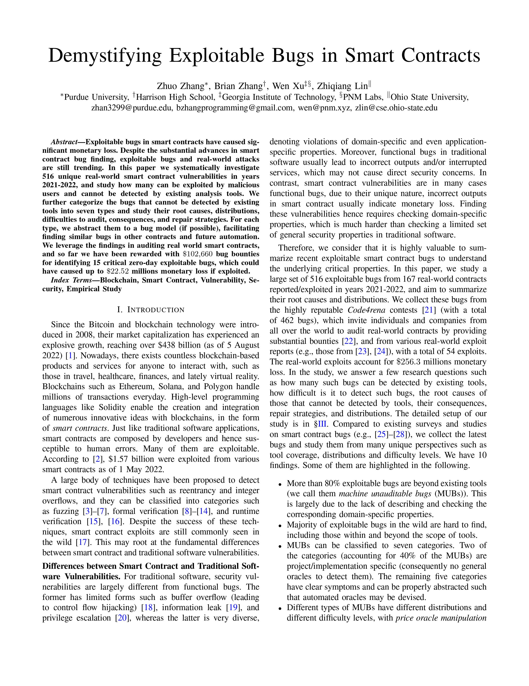

# Demystifying Exploitable Bugs in Smart Contracts <a href="https://openai.com/product/dall-e-2"></a>

[](https://github.com/ZhangZhuoSJTU/Web3Bugs/actions/workflows/validate.yml)

<p>
<a href="papers/icse23.pdf"> </a>

This project aims to provide a valuable resource for Web3 developers and security analysts by facilitating their understanding of exploitable bugs in smart contracts. We conduct a thorough analysis of exploitable bugs extracted from [code4rena](https://code4rena.com/) and classify each bug according to its nature.

Our initial research suggests that a notable proportion of exploitable bugs in smart contracts are functional bugs, which cannot be detected using simple and general oracles like reentrancy. We aim to raise awareness about the significance of such bugs and encourage practitioners to develop more sophisticated and nuanced automatic semantical oracles to detect them.
</p>

<br>

> 𝙰 𝚜𝚒𝚐𝚗𝚒𝚏𝚒𝚌𝚊𝚗𝚝 𝚗𝚞𝚖𝚋𝚎𝚛 𝚘𝚏 𝚎𝚡𝚙𝚕𝚘𝚒𝚝𝚊𝚋𝚕𝚎 𝚋𝚞𝚐𝚜 𝚒𝚗 𝚜𝚖𝚊𝚛𝚝 𝚌𝚘𝚗𝚝𝚛𝚊𝚌𝚝𝚜 𝚏𝚊𝚕𝚕 𝚞𝚗𝚍𝚎𝚛 𝚝𝚑𝚎 𝚌𝚊𝚝𝚎𝚐𝚘𝚛𝚢 𝚘𝚏 𝚏𝚞𝚗𝚌𝚝𝚒𝚘𝚗𝚊𝚕 𝚋𝚞𝚐𝚜, 𝚠𝚑𝚒𝚌𝚑 𝚌𝚊𝚗𝚗𝚘𝚝 𝚋𝚎 𝚍𝚎𝚝𝚎𝚌𝚝𝚎𝚍 𝚞𝚜𝚒𝚗𝚐 𝚜𝚒𝚖𝚙𝚕𝚎 𝚊𝚗𝚍 𝚐𝚎𝚗𝚎𝚛𝚊𝚕 𝚘𝚛𝚊𝚌𝚕𝚎𝚜.

<br>

Please be aware that __this repository is currently undergoing active development, and the data may change over time due to ongoing code4rena contests__.

## Dataset Description

### Folder Structure

The dataset is organized into four folders:

+ [papers/](papers/): contains our ICSE23 paper summarizing our preliminary results, as well as the supplementary material for the paper.
+ [results/](results/): contains the bug classification in [bugs.csv](results/bugs.csv) and the description for each contest in [contests.csv](results/contests.csv).
+ [contracts/](contracts/): contains all the smart contracts that we examined, using the version at the time of the contest.
+ [reports/](reports/): contains all the reports provided by code4rena.

### Bug Labels

We classify the surveyed bugs into three main categories based on their nature: 

+ Out-of-scope bugs (denoted by __O__)
+ Bugs with simple and general testing oracles (denoted by __L__)
+ Bugs that require high-level semantical oracles (denoted by __S__)

As classifying functional bugs can be ambiguous, we welcome suggestions to improve our classification standards. You can find more detailed label information in our [documentation](docs/standard.md), and we encourage you to refer to our current classification [guidelines](docs/standard.md#process) for more information.

## Recommended Security Analysis Tools

Our goal is to create a comprehensive list of vulnerability detection techniques that will be a valuable resource for Web3 developers and security analysts. We will focus on two main categories:

+ Vulnerability detection techniques that prioritize the development of semantical oracles for smart contracts.
+ Publicly available security analysis tools that can be used for auditing

<span style="color:red"><strong>We warmly welcome any additional suggestions or contributions from the community to help expand and improve the list. </strong></span> 

### Vulnerability Detection with Automatic Semantical Oracles

We believe that future web3 security efforts will prioritize identifying functional bugs and developing corresponding oracles. To this end, we intend to compile a list of techniques that provide guidance in the creation of automatic semantic oracles. These techniques will be sourced from various materials, such as peer-reviewed research papers, pre-prints, industry tools, and online resources.

| Technique                                                                                                                                          | Bug Category   |
| :------------------------------------------------------------------------------------------------------------------------------------------------- | :------------- |
| [Finding Permission Bugs in Smart Contracts with Role Mining](https://personal.ntu.edu.sg/yi_li/files/Liu2022FPB.pdf)                              | Access Control |
| [AChecker: Statically Detecting Smart Contract Access Control Vulnerabilities](https://people.ece.ubc.ca/mjulia/publications/ACheckerICSE2023.pdf) | Access Control |
| [Towards Automated Verification of Smart Contract Fairness](https://personal.ntu.edu.sg/yi_li/files/Liu2020TAV.pdf) | Fairness Property |
| [Clockwork Finance: Automated Analysis of Economic Security in Smart Contracts](https://www.computer.org/csdl/proceedings-article/sp/2023/933600a622/1He7Yru4ls4) | TBD |
| [Confusum Contractum: Confused Deputy Vulnerabilities in Ethereum Smart Contracts](https://seclab.cs.ucsb.edu/files/publications/gritti23confusum.pdf) | Confused Deputy |
| [Not your Type! Detecting Storage Collision Vulnerabilities in Ethereum Smart Contracts](https://seclab.cs.ucsb.edu/files/publications/ruaro24crush.pdf)    | Storage Collision |


### Publicly Available Security Analysis Techniques

This section will include open-source techniques that are publicly available and currently in active development. These techniques can be used either directly by Web3 developers and security analysts or as building blocks for other tools. We give priority to source-code level techniques, which are better suited for Web3 development and auditing contexts.

| Technique                                                                        | Developer(s)                                               | Description                                  | Security-related Keywords                                                                                                                                                                                                                                                                                                                                                                                                                                                                                                                                                |
| :------------------------------------------------------------------------------- | :--------------------------------------------------------- | :------------------------------------------- | :----------------------------------------------------------------------------------------------------------------------------------------------------------------------------------------------------------------------------------------------------------------------------------------------------------------------------------------------------------------------------------------------------------------------------------------------------------------------------------------------------------------------------------------------------------------------- |
| [Slither](https://github.com/crytic/slither)                                     | [Trail of Bits](https://www.trailofbits.com/)              | Static Analysis Framework                    | [Vulnerability Detectors](https://github.com/crytic/slither/blob/master/trophies.md), [SlithIR](https://github.com/crytic/slither/wiki/SlithIR)                                                                                                                                                                                                                                                                                                                                                                                                                          |
| [Aderyn](https://github.com/Cyfrin/aderyn)                                       | [Cyfrin](https://www.cyfrin.io/)                           | Static Analysis Framework                    | Static Analyzer, Custom Detectors, Markdown Reports                                                                                                                                                                                                                                                                                                                                                                                                                        |
| [Foundry](https://github.com/foundry-rs/foundry)                                 | [Paradigm](https://www.paradigm.xyz/)                      | Development Toolchain                        | [Fuzzing](https://book.getfoundry.sh/forge/fuzz-testing), [Stateful Fuzzing (Invariant Testing)](https://book.getfoundry.sh/forge/invariant-testing#invariant-testing), [Differential Testing](https://book.getfoundry.sh/forge/differential-ffi-testing#differential-testing)                                                                                                                                                                                                                                                                                           |
| [Echidna](https://github.com/crytic/echidna)                                     | [Trail of Bits](https://www.trailofbits.com/)              | Fuzzer                                       | [Fuzzing](https://github.com/crytic/echidna#echidna-a-fast-smart-contract-fuzzer-)                                                                                                                                                                                                                                                                                                 , [Stateful Fuzzing (Invariant Testing)](https://github.com/crytic/echidna#writing-invariants), [CI/CD](https://github.com/crytic/echidna#using-echidna-in-a-github-actions-workflow) |
| [Optik](https://github.com/crytic/optik)                                         | [Trail of Bits](https://www.trailofbits.com/)              | Hybrid Fuzzer (Symbolic Execution + Fuzzing) | Fuzzing, Stateful Fuzzing, Symbolic Execution                                                                                                                                                                                                                                                                                                                                                                                                                                                                                                                            |
| [Woke](https://github.com/Ackee-Blockchain/woke)                                 | [Ackee Blockchain](https://ackeeblockchain.com/)           | Development Toolchain                        | [Cross-chain Testing](https://ackeeblockchain.com/woke/docs/2.1.0/testing-framework/cross-chain-testing/#relaying-events), [Invariant Testing](https://ackeeblockchain.com/woke/docs/2.1.0/testing-framework/fuzzing/), [Vulnerability Detectors](https://ackeeblockchain.com/woke/docs/devel/detectors/), [IR](https://ackeeblockchain.com/woke/docs/devel/api-reference/ir/abc/)                                                                                                                                                                                       |
| [4naly3er](https://github.com/Picodes/4naly3er)                                  | [Picodes](https://twitter.com/thePicodes)                  | Static Scanner                               | [Code4rena Pre-content Testing](https://docs.code4rena.com/roles/wardens/submission-policy#automated-findings-ineligible)                                                                                                                                                                                                                                                                                                                                                                                                                                                |
| [Manticore](https://github.com/trailofbits/manticore)                            | [Trail of Bits](https://www.trailofbits.com/)              | Symbolic Execution Tool                      | Symbolic Execution, [Property Testing](https://manticore.readthedocs.io/en/latest/verifier.html)                                                                                                                                                                                                                                                                                                                                                                                                                                                                         |
| [Halmos](https://github.com/a16z/halmos)                                         | [a16z](https://github.com/a16z)                            | Symbolic Bounded Model Checker               | Symbolic Execution, Bound Checker                                                                                                                                                                                                                                                                                                                                                                                                                                                                                                                                        |
| [Solidity SMTChecker](https://docs.soliditylang.org/en/latest/smtchecker.html)   | [Ethereum Foundation](https://ethereum.org/en/foundation/) | Formal Verification by Symbolic Execution     | Solidity, Formal Verification, Symbolic Execution                                                                                                                                                                                                                                                                                                                                                                                                                                                                                                                        |
| [Mythril](https://github.com/ConsenSys/mythril)                                  | [Consensys](https://consensys.net/)                        | Symbolic Execution Tool                       | Symbolic Execution, [On-Chain Analysis](https://mythril-classic.readthedocs.io/en/develop/security-analysis.html#analyzing-on-chain-contracts), [Vulnerability Detectors](https://mythril-classic.readthedocs.io/en/develop/analysis-modules.html), Taint Analysis |
| [Pyrometer](https://github.com/nascentxyz/pyrometer) __[WIP]__                       | [Nascent](https://www.nascent.xyz/)                        | Symbolic Execution Tool  | Symbolic Execution, Abstract Interpretation |
| [greed](https://github.com/ucsb-seclab/greed)                                        | [UCSB Seclab](https://seclab.cs.ucsb.edu/)                 | Static/Symbolic Analysis Framework |  Symbolic Execution, Bound Checker, Static Analyses, Property Testing
| [ethpwn](https://github.com/ethpwn/ethpwn)                                           | [ethpwn](https://github.com/ethpwn/)                       | Dynamic analysis/Debugging                | EVM simulations, EVM debugging

<details>
<summary>In addition, we curate a catalogue of security utilities applicable to smart contract programming languages beyond Solidity.</summary></br>

| Technique                                                                        | Language                                               | Description                                  | Security-related Keywords                                                                                                                                                                                                                                                                                                                                                                                                                                                                                                                                                |
| :------------------------------------------------------------------------------- | :--------------------------------------------------------- | :------------------------------------------- | :----------------------------------------------------------------------------------------------------------------------------------------------------------------------------------------------------------------------------------------------------------------------------------------------------------------------------------------------------------------------------------------------------------------------------------------------------------------------------------------------------------------------------------------------------------------------- |
| [Move Prover](https://github.com/move-language/move/tree/main/language/move-prover) | [Move](https://github.com/move-language) | Formal Specification and Verification     | Formal Verification |
</details>

### Valuable Resources for Web3 Security

<details>
<summary>This section comprises a compilation of resources that pertain to web3 security.</summary></br>

| Resource | Keywords |
| :-------- | :------- |
| [Academic Smart Contract Papers](https://github.com/hzysvilla/Academic_Smart_Contract_Papers) | Academic Paper List |
| [DeFi Hacks Reproduce - Foundry](https://github.com/SunWeb3Sec/DeFiHackLabs) | Attack Replication |
| [Smart Contract Security Verification Standard](https://github.com/ComposableSecurity/SCSVS) | Security Checklist  |
| [Awesome MythX Smart Contract Security Tools](https://github.com/muellerberndt/awesome-mythx-smart-contract-security-tools) | Security Analysis Service |
| [Common Security Properties of Smart Contracts](https://github.com/crytic/properties) | Security Compliance Suite |
| [Immunefi PoC Templates](https://github.com/immunefi-team/forge-poc-templates) | PoC Templates |
| [Awesome MEV Resources](https://github.com/0xalpharush/awesome-MEV-resources) | MEV Resources |
| [Front-Running Attack Benchmark Construction and Vulnerability Detection Technique Evaluation](https://arxiv.org/abs/2212.12110) | Front-Running Dataset |
| [Ultimate DeFi & Blockchain Research Base](https://github.com/OffcierCia/ultimate-defi-research-base) | Blockchain Security All-in-One |
| [Common Fork Bugs](https://github.com/YAcademy-Residents/defi-fork-bugs) | Exploit Dataset |
</details>

## Contributing

We welcome all types of contributions to our project, including but not limited to:

+ <span style="color:red"><strong>Suggesting new reference techniques for smart contract security analysis.</strong></span>
+ Adding newly disclosed code4rena contest bugs.
+ Suggesting improvements to the classification standard
+ Correcting mislabeled bugs
+ Filling in any missing defillama entities in the `results/contests.csv`

Further details can be found in our [contribution guidelines](docs/contribution.md).

## Cite

If you are using our dataset for an academic publication, we would really appreciate a citation to the following work:

```
@inproceedings{DBLP:conf/icse/ZhangZXL23,
  author       = {Zhuo Zhang and
                  Brian Zhang and
                  Wen Xu and
                  Zhiqiang Lin},
  title        = {Demystifying Exploitable Bugs in Smart Contracts},
  booktitle    = {{ICSE}},
  pages        = {615--627},
  publisher    = {{IEEE}},
  year         = {2023}
}
```

## Clarification

Please refer to our classification [documentation](docs/classification.md).

## Acknowledgments

We would like to extend our sincere thanks to [code4rena](https://code4rena.com/) for making this valuable information publicly available.

<details>
<summary>Our appreciation also goes out to the following contributors for their valuable input.</summary></br>

+ [__ItsNio__](https://github.com/niothefirst)
+ [__Wen Xu__](https://github.com/tarafans)
+ [__Patrick Collins__](https://github.com/PatrickAlphaC)
+ [__Meng Xu__](https://twitter.com/meng_xu_cs)
+ [__y3s0n__](https://github.com/CharesFang)
+ [__William Aaron Cheung__](https://github.com/Troublor)
+ [__soaphorn__](https://github.com/soaphorn)
+ [__Fabio Gritti__](https://github.com/degrigis)
+ [__Yannick__](https://twitter.com/MillusPontius)

</details>
