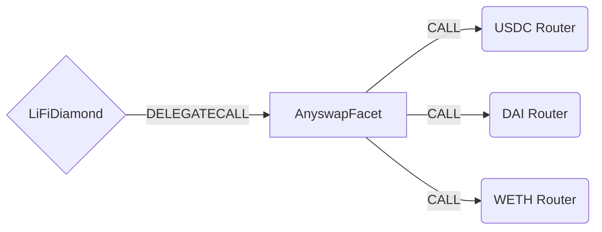

# Anyswap Facet

## How it works

The Hop Facet works by forwarding Anyswap specific calls to a token specific [router contract](https://github.com/anyswap/anyswap-v1-core/blob/master/contracts/AnyswapV5Router.sol). Anyswap works by locking tokens into a router contract on a base chain before bridging. Tokens can then be minted by a router contract on the receiving chain. This is handled by a decentralized network of [MPC nodes](https://docs.multichain.org/how-it-works) under the hood.



## Public Methods

- `function startBridgeTokensViaAnyswap(LiFiData memory _lifiData, AnyswapData calldata _anyswapData)`
  - Simply bridges tokens using Anyswap
- `function swapAndStartBridgeTokensViaAnyswap( LiFiData memory _lifiData, LibSwap.SwapData[] calldata _swapData, AnyswapData memory _anyswapData)`
  - Performs swap(s) before bridging tokens using Anyswap

## Anyswap Specific Parameters

Some of the methods listed above take a variable labeled `_anyswapData`.

To populate `_anyswapData` you will need to fetch the router address for the chain ID you are bridging from. You can use the [Anyswap API](https://github.com/anyswap/CrossChain-Router/wiki/How-to-integrate-AnySwap-Router) to do this.

This data is specific to Anyswap and is represented as the following struct type:

```solidity
/**
 * @param token Address of the contract for the token being bridged.
 * @param router Address of the router contract for the token being bridged.
 * @param amount Amount of the token being bridged.
 * @param recipient Recipient address
 * @param chainId Chain ID of the chain to bridge tokens to
 */
struct AnyswapData {
  address token;
  address router;
  uint256 amount;
  address recipient;
  uint256 toChainId;
}

```

## Swap Data

Some methods accept a `SwapData _swapData` parameter.

Swapping is performed by a swap specific library that expects an array of calldata to can be run on variaous DEXs (i.e. Uniswap) to make one or multiple swaps before performing another action.

The swap library can be found [here](../src/Libraries/LibSwap.sol).

## LiFi Data

Some methods accept a `LiFiData _lifiData` parameter.

This parameter is strictly for analytics purposes. It's used to emit events that we can later track and index in our subgraphs and provide data on how our contracts are being used. `LiFiData` and the events we can emit can be found [here](../src/Interfaces/ILiFi.sol).

## Getting Sample Calls to interact with the Facet

In the following some sample calls are shown that allow you to retrieve a populated transaction that can be sent to our contract via your wallet.

All examples use our [/quote endpoint](https://apidocs.li.finance/reference/get_quote-1) to retrieve a quote which contains a `transactionRequest`. This request can directly be sent to your wallet to trigger the transaction.

The quote result looks like the following:

```javascript
const quoteResult = {
    "id": "0x...",           // quote id
    "type": "lifi",          // the type of the quote (all lifi contract calls have the type "lifi")
    "tool": "hop",           // the bridge tool used for the transaction
    "action": {},            // information about what is going to happen
    "estimate": {},          // information about the estimated outcome of the call
    "includedSteps": [],     // steps that are executed by the contract as part of this transaction, e.g. a swap step and a cross step
    "transactionRequest": {  // the transaction that can be sent using a wallet
        "data": "0x...",
        "to": "0x...",
        "value": "0x00",
        "from": "{YOUR_WALLET_ADDRESS}",
        "chainId": 100,
        "gasLimit": "0x...",
        "gasPrice": "0x..."
    }
}
```

A detailed explanation on how to use the /quote endpoint and how to trigger the transaction can be found [here](https://apidocs.li.finance/reference/how-to-transfer-tokens).

**Hint**: Don't forget to replace `{YOUR_WALLET_ADDRESS}` with your real wallet address in the examples.

### Cross Only
To get a transaction for a transfer from 20 DAI on Polygon to DAI on Fantom you can execute the following request:
```shell
curl 'https://li.quest/v1/quote?fromChain=POL&fromAmount=20000000000000000000&fromToken=DAI&toChain=FTM&toToken=DAI&slippage=0.03&allowBridges=multichain&fromAddress={YOUR_WALLET_ADDRESS}'
```

### Swap & Cross
To get a transaction for a transfer from 10 MATIC on Polygon to DAI on Fantom you can execute the following request:
```shell
curl 'https://li.quest/v1/quote?fromChain=POL&fromAmount=10000000000000000000&fromToken=MATIC&toChain=FTM&toToken=DAI&slippage=0.03&allowBridges=multichain&fromAddress={YOUR_WALLET_ADDRESS}'
```
