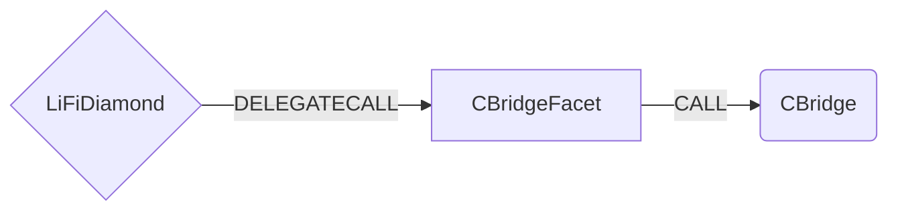

# CBridge Facet

## How it works

The CBridge Facet works by forwarding CBridge specific calls to the [CBridge contract](https://github.com/celer-network/sgn-v2-contracts/blob/main/contracts/Bridge.sol). All bridging is done by calling the `send` method or `sendNative` method if you using a native token like **ETH** or **MATIC**.



## Public Methods

- `function initCbridge(address _cBridge, uint64 _chainId)`
  - Initializer method. Sets chainId and CBridge contract for the specific chain
- `function startBridgeTokensViaCBridge(LiFiData memory _lifiData, CBridgeData calldata _cBridgeData)`
  - Simply bridges tokens using CBridge
- `function swapAndStartBridgeTokensViaCBridge( LiFiData memory _lifiData, LibSwap.SwapData[] calldata _swapData, CBridgeData memory _cBridgeData)`
  - Performs swap(s) before bridging tokens using CBridge

## CBridge Specific Parameters

Some of the methods listed above take a variable labeled `_cBridgeData`. This data is specific to CBridge and is represented as the following struct type:

```solidity
/**
 * @param receiver The address of the token recipient after bridging.
 * @param token The contract address of the token being bridged.
 * @param amount The amount of tokens to bridge.
 * @param dstChainId The chainId of the chain to bridge to.
 * @param nonce Unique number used for this specific bridging TX.
 * @param maxSlippage The maximum slippage in percent tolerated for bridging.
 */
struct CBridgeData {
  address receiver;
  address token;
  uint256 amount;
  uint64 dstChainId;
  uint64 nonce;
  uint32 maxSlippage;
}

```

## Swap Data

Some methods accept a `SwapData _swapData` parameter.

Swapping is performed by a swap specific library that expects an array of calldata to can be run on variaous DEXs (i.e. Uniswap) to make one or multiple swaps before performing another action.

The swap library can be found [here](../src/Libraries/LibSwap.sol).

## LiFi Data

Some methods accept a `LiFiData _lifiData` parameter.

This parameter is strictly for analytics purposes. It's used to emit events that we can later track and index in our subgraphs and provide data on how our contracts are being used. `LiFiData` and the events we can emit can be found [here](../src/Interfaces/ILiFi.sol).

## Getting Sample Calls to interact with the Facet

In the following some sample calls are shown that allow you to retrieve a populated transaction that can be sent to our contract via your wallet.

All examples use our [/quote endpoint](https://apidocs.li.finance/reference/get_quote-1) to retrieve a quote which contains a `transactionRequest`. This request can directly be sent to your wallet to trigger the transaction.

The quote result looks like the following:

```javascript
const quoteResult = {
    "id": "0x...",           // quote id
    "type": "lifi",          // the type of the quote (all lifi contract calls have the type "lifi")
    "tool": "hop",           // the bridge tool used for the transaction
    "action": {},            // information about what is going to happen
    "estimate": {},          // information about the estimated outcome of the call
    "includedSteps": [],     // steps that are executed by the contract as part of this transaction, e.g. a swap step and a cross step
    "transactionRequest": {  // the transaction that can be sent using a wallet
        "data": "0x...",
        "to": "0x...",
        "value": "0x00",
        "from": "{YOUR_WALLET_ADDRESS}",
        "chainId": 100,
        "gasLimit": "0x...",
        "gasPrice": "0x..."
    }
}
```

A detailed explanation on how to use the /quote endpoint and how to trigger the transaction can be found [here](https://apidocs.li.finance/reference/how-to-transfer-tokens).

**Hint**: Don't forget to replace `{YOUR_WALLET_ADDRESS}` with your real wallet address in the examples.

### Cross Only
To get a transaction for a transfer from 30 USDC.e on Avalanche to USDC on Binance you can execute the following request:
```shell
curl 'https://li.quest/v1/quote?fromChain=AVA&fromAmount=30000000&fromToken=0xa7d7079b0fead91f3e65f86e8915cb59c1a4c664&toChain=BSC&toToken=USDC&slippage=0.03&allowBridges=cbridge&fromAddress={YOUR_WALLET_ADDRESS}'
```

### Swap & Cross
To get a transaction for a transfer from 30 USDT on Avalanche to USDC on Binance you can execute the following request:
```shell
curl 'https://li.quest/v1/quote?fromChain=AVA&fromAmount=30000000&fromToken=USDT&toChain=BSC&toToken=USDC&slippage=0.03&allowBridges=cbridge&fromAddress={YOUR_WALLET_ADDRESS}'
```
