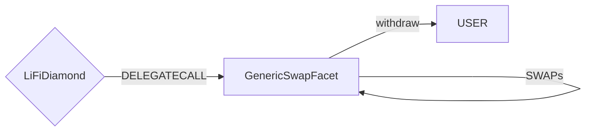

# Generic Swap Facet

## How it works

The Generic Swap Facet is only used to make swaps or multiple swaps without bridging in a single transaction.

It does this by using the [LibSwap](./LibSwap.md) library.

## Public Methods

- `function swapTokensGeneric(LiFiData memory _lifiData, LibSwap.SwapData[] calldata _swapData)`
  - Performs swap(s) before withdrawing the final token to the user

## Swap Data

Some methods accept a `SwapData _swapData` parameter.

Swapping is performed by a swap specific library that expects an array of calldata to can be run on variaous DEXs (i.e. Uniswap) to make one or multiple swaps before performing another action.

The swap library can be found [here](../src/Libraries/LibSwap.sol).

## LiFi Data

Some methods accept a `LiFiData _lifiData` parameter.

This parameter is strictly for analytics purposes. It's used to emit events that we can later track and index in our subgraphs and provide data on how our contracts are being used. `LiFiData` and the events we can emit can be found [here](../src/Interfaces/ILiFi.sol).
