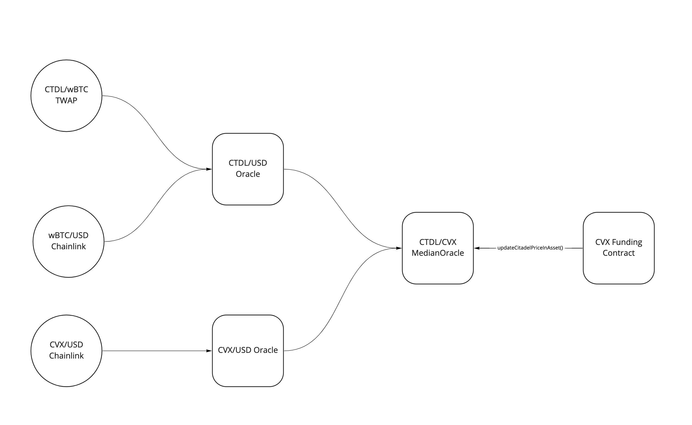

# Oracles

Oracles are critical for funding. We need to understand the market price of CTDL and the funding assets in order to apply a discount to the CTDL/$ASSET price.

The Funding contract has an oracle, and the state can be updated by keepers via `updateCitadelPriceInAsset()`

All CTDL/ASSET oracles ultimately use the MedianOracle as the source of the CTDL/ASSET price. This allows us to concatinate a variety of oracles sources when possible and desired.

## Example: CTDL/wBTC

## Example: CTDL/CVX

