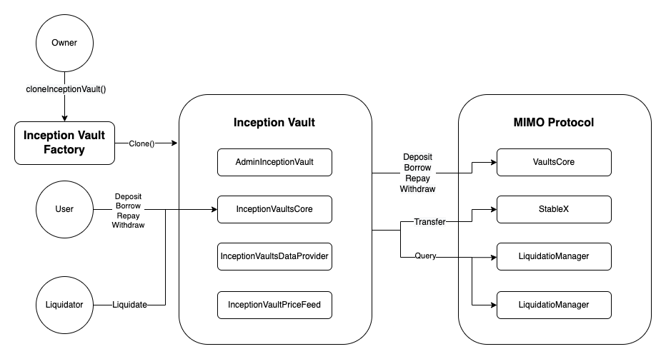
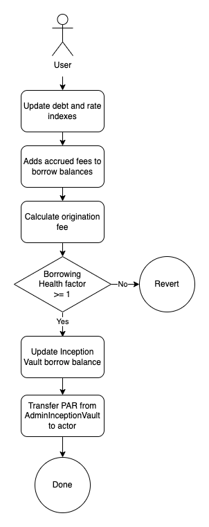

# Inception Vault

## Content

- [Concept](#Concept)
- [Technical specifications](#Technical-specifications)
- [Contract Addresses](#Contract-Addresses)

## Concept

The MIMO Inception Vault makes it possible to use any ERC20 as collateral by adding a lending & borrowing layer on top of the MIMO protocol vaults. It enables **owners** to generate yield with their minted PAR and **users** to leverage their ERC20 to borrow PAR.

### Owners

Let's say you have WETH with some minted PAR on the MIMO protocol. The idea is to be able to use those minted PAR to generate more yield or go long on other crypto assets. In order to do so you would most likely have to swap PAR for other assets or possibly provide liquidity. The Inception Vault creates a new way of generating yield on your minted PAR by lending it out against a new ERC20 collateral.

### Users

Let's say a new inception vault is created accepting $DOGE as collateral and you happen to have some in your portfolio. You can now deposit your $DOGE in this new inception vault and borrow PAR against it.

## Technical specifications

### Architecture

|  |
| :-----------------------------------------------------------------: |
|             <b>Fig.1 - Inception Vault Architecture</b>             |

As mentioned before the Inception Vault is build on top of the existing MIMO protocol. It leverages and repoduces existing logic such as :

- Deposit
- Borrow
- Repay
- Withdraw
- Liquidate

The main differences between the inception vault mecanics and the MIMO protocol are the following :

- PARs are lended not minted
- PARs and repaid not burned
- Debt limit is not configured but defined by the `AdminInceptionVault` PAR balance

The owner deploys all 3 Inception Vault contracts by calling the `cloneInceptionVault()` function from the [InceptionVaultFactory](../../contracts/inception/InceptionVaultFactory) :

- [AdminInceptionVault](../../contracts/inception/AdminInceptionVault.sol)
- [InceptionVaultsCore](../../contracts/inception/InceptionVaultsCore.sol)
- [InceptionVaultsDataProvider](../../contracts/inception/InceptionVaultsDataProvider.sol)
- [InceptionVaultPriceFeed](../../contracts/inception/priceFeed/ChainlinkInceptionPriceFeed.sol)

Users and liquidators will only interact with the InceptionVaultsCore.

### Borrowing

Borrowers can repay or borrow more PAR at any time, within the limits of the MCR. Borrowing alters the available PAR in the `AdminInceptionVault` contract. When one borrows, the Vaults contract transfers PAR from the `AdminInceptionVault` contract to the borrower.

|  |
| :---------------------------------------------------------------------: |
|                      <b>Fig.2 - Borrowing PAR</b>                       |

Borrowers can continue to borrow PAR as long as they deposit a greater value of collateral in their vault and within the limit of the `AdminInceptionVault` PAR balance. This guarantees that all borrowed PAR are fully backed by sufficient collateral.

### Liquidation

The main difference between inception vault liquidation and the MIMO protocol's is that because the liquidation configurations (liquidation ratio, liquidation bonus and liquidation fee) are configured by the owner at creation, the owner can design how to incentivize liquidation.

|  |
| :----------------------------------------------------------------------------: |
|                       <b>Fig.2 - Liquidating a Vault</b>                       |

Same goes for the safety reserve which can be implemented by the inception vault owner either by leaving the accrued fees in the `AdminInceptionVault` or funding the contract with additinal PARs.

### InceptionVaultFactory

This contract is responsible for deploying and initializing the 3 Inception Vault contracts. For gas efficiency the deployment is done using the OpenZeppelin [Clones](https://github.com/OpenZeppelin/openzeppelin-contracts/blob/master/contracts/proxy/Clones.sol) library.

The contract also keeps track of all deployed inception vaults in their owner :

```
struct InceptionVault {
    address owner;
    IAdminInceptionVault adminInceptionVault;
    IInceptionVaultsCore inceptionVaultsCore;
    IInceptionVaultsDataProvider inceptionVaultsDataProvider;
    IInceptionVaultPriceFeed inceptionVaultPriceFeed;
    bool isCustomPriceFeed;
  }
```

The InceptionVaultFactory contract has the following interface :

```
function cloneInceptionVault(
    IInceptionVaultsCore.VaultConfig calldata _vaultConfig,
    IERC20 _inceptionCollateral,
    address _inceptionVaultPriceFeed,
    AggregatorV3Interface _assetOracle
  ) external;
function addPriceFeed(address _address) external;
```

### AdminInceptionVault

This contract acts as an intermediary between the inception vault owner and the MIMO protocol. It allows the owner to perform the following operations on VaultsCore :

- Depositing
- Borrowing
- Repaying
- Withdrawing

The contract also stores and lends out the minted PAR from the MIMO protocol.

There is also a `claimMimo()` function enabling the contract to claim earned MIMO through PAR minting.

The AdminInceptionVault contract has the following interface :

```
interface IAdminInceptionVault {
  function initialize(
    address owner,
    IAddressProvider _addressProvider,
    IDebtNotifier _debtNotifier,
    IWETH _WETH,
    IERC20 _mimo,
    IInceptionVaultsCore _inceptionVaultsCore
  ) external;
  function depositETH() external payable;
  function depositETHAndBorrow(uint256 _borrowAmount) external payable;
  function deposit(address _collateralType, uint256 _amount) external;
  function depositAndBorrow(
    address _collateralType,
    uint256 _depositAmount,
    uint256 _vaultId
  ) external;
  function borrow(uint256 _vaultId, uint256 _amount) external;
  function withdraw(uint256 _vaultId, uint256 _amount) external;
  function claimMimo() external;
  function lendPAR(uint256 _amoutn, address _to) external;
  function transferMimo(uint256 _amount, address _to) external;
  function transferPar(uint256 _amount, address _to) external;
}
```

### InceptionVaultsCore

The IncepionVaultsCore contract is the main interface for users to interact with the Inception Vault. It handles all the Inception Vault logic, which is the exact same logic used in the MIMO protocol but for a new ERC20 collateral. It also owns the global state (cumulative rate & last refresh) and perform all state updates.

The contract leverages the existing MIMO protocol architecture to perform checks and queries :

- Price queries are done through the [PriceFeed](../../contracts/core/PriceFeed.sol)
- Debt calculations are done through the [RatesManager](../../contract/core/RatesManager.sol)
- Health checks, liquidation bonus and discounts calculations are done through the [LiquidationManager](../../contracts/core/LiquidationManager.sol)

The contract also stores all ERC20 collaterals.

The Inception `VaultConfig` is the equivalent of the `CollateralConfig` in the `ConfigProvider` with the exception of the `collateralType` as there can only be one `inceptionCollateral` per inception vault.

This configuration is set by the inception vault owner at deployment.

```
 struct VaultConfig {
    uint256 liquidationRatio;
    uint256 minCollateralRatio;
    uint256 borrowRate;
    uint256 originationFee;
    uint256 liquidationBonus;
    uint256 liquidationFee;
  }
```

The InceptionVaultsCore contract has the following interface :

```
  function initialize(
    address _owner,
    VaultConfig calldata _vaultConfig,
    IERC20 _inceptionCollateral,
    IAddressProvider _addressProvider,
    IAdminInceptionVault _adminInceptionVault,
    IInceptionVaultsDataProvider _inceptionVaultsDataProvider
  ) external;
  function deposit(uint256 _amount) external;
  function depositByVaultId(uint256 _vaultId, uint256 _amount) external;
  function depositAndBorrow(uint256 _depositAmount, uint256 _borrowAmount) external;
  function withdraw(uint256 _vaultId, uint256 _amount) external;
  function borrow(uint256 _vaultId, uint256 _amount) external;
  function repayAll(uint256 _vaultId) external;
  function repay(uint256 _vaultId, uint256 _amount) external;
  function liquidate(uint256 _vaultId) external;
  function liquidatePartial(uint256 _vaultId, uint256 _amount) external;
  function getCumulativeRate() external view returns (uint256);
}
```

### InceptionVaultsDataProvider

This contract handles individual vaults state, base detb and vault related read functions.

```
  struct InceptionVault {
    address owner;
    uint256 collateralBalance;
    uint256 baseDebt;
    uint256 createdAt;
  }
```

The InceptionVaultsDataProvider contract has the following interface :

```
interface IInceptionVaultsDataProvider {
  function initialize(IInceptionVaultsCore _inceptionVaultsCore, IAddressProvider _addressProvider) external;
  function createVault(address _owner) external returns (uint256);
  function setCollateralBalance(uint256 _id, uint256 _balance) external;
  function setBaseDebt(uint256 _id, uint256 _newBaseDebt) external;
  function vaults(uint256 _id) external view returns (InceptionVault memory);
  function vaultOwner(uint256 _id) external view returns (address);
  function vaultCollateralBalance(uint256 _id) external view returns (uint256);
  function vaultBaseDebt(uint256 _id) external view returns (uint256);
  function vaultId(address _owner) external view returns (uint256);
  function vaultExists(uint256 _id) external view returns (bool);
  function vaultDebt(uint256 _vaultId) external view returns (uint256);
}
```

### InceptionVaultPriceFeed

In order to give owners and users access to a maxmium of collateral types we cannot limit the inception vault to only one oracle such as chainlink. As price query logics differ from one oracle to another, the InceptionVaultPriceFeed contract acts as an intermediary contract to be able to intergrate any oracle logic into a standard interface. This way owners will also be able to create their own oracle for their inception vault.

This increased flexibility for owners could lead to dishonest behaviours by either modifying the originial InceptionVaultPriceFeed contract and using a custom InceptionVaultPriceFeed and/or using a custom oracle giving the owner access to price manipulation.

To address those risks, in order to be listed on the Mimo webapp, the deployed InceptionVaultPriceFeeds will have to meet 2 requirements :

1. The deployed contract will have to have used an approved InceptionVaultPriceFeed
2. The oracle set in the InceptionPriceFeed will have to be approved

The only way to use an approved InceptionVaultPriceFeed is to use the address of one of the base InceptionVaultPriceFeeds (Chainlink, UniV3...) deployed by the team as the `_inceptionVaultPriceFeed` argument and a non `address(0)` argument as the `_assetOracle`.
By doing so the selected InceptionVaultPriceFeed will be cloned and the InceptionVault struct will have an `isCustomPriceFeed` of false.

The oracle verification will have to be done by the team directly with the current design.

The InceptionVaultPriceFeed contract has the following interface :

```
function initialize(
    IAddressProvider _addresses,
    address _inceptionCollateral,
    AggregatorV3Interface _assetOracle,
    AggregatorV3Interface _eurOracle
  ) external;
  function a() external view returns (IAddressProvider);
  function inceptionCollateral() external view returns (ERC20);
  function assetOracle() external view returns (AggregatorV3Interface);
  function eurOracle() external view returns (AggregatorV3Interface);
  function getAssetPrice() external view returns (uint256);
  function convertFrom(uint256 _amount) external view returns (uint256);
  function convertTo(uint256 _amount) external view returns (uint256);
```

## Contract Addresses

### Kovan Deployment

| Contract                        | Etherscan                                                                          |
| ------------------------------- | ---------------------------------------------------------------------------------- |
| BaseAdminInceptionVault         | https://kovan.etherscan.io/address/0x0865CC6493Ee151A9a31020559f7e9FaD1e38ff5#code |
| BaseInceptionVaultsCore         | https://kovan.etherscan.io/address/0x0f3505F3dd1Ac7Df06810F300534879edD3Bf0Ac#code |
| BaseInceptionVaultsDataProvider | https://kovan.etherscan.io/address/0xc87d1e7B3bD52431e77F25f782D283C6d8fD68b0#code |
| InceptionVaultFactory           | https://kovan.etherscan.io/address/0x6484fA26e6fbdCe14a20E0d8AFa5d3D085376A55#code |
| ChainlinkInceptionPriceFeed     | https://kovan.etherscan.io/address/0x0474cF29BB6B853718776aB8cB07b29e73AA1Ea1#code |
