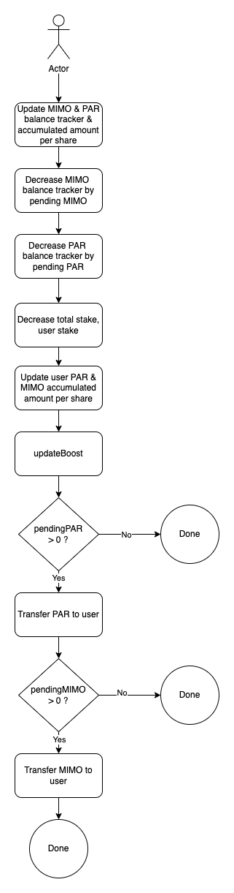
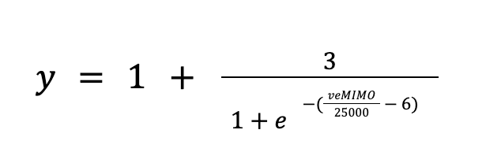
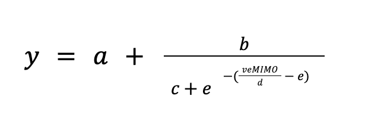

# V2 Miners

## Content

- [Introduction](#introduction)
- [Technical Specifications](#technical-specifications)
- [Contract Addresses](#contract-addresses)

## Introduction

The version 2 of our miners brings the following new features for our users :

- [PAR rewards](#par-rewards)
- [APY boost](#apy-boost)

These new features will be available accross all miners through V2 contracts :

- [SupplyMinerV2](../../../contracts/liquidityMining/v2/SupplyMinerV2.sol)
- [DemandMinerV2](../../../contracts/liquidityMining/v2/DemandMinerV2.sol)
- [VotingMinerV2](../../../contracts/liquidityMining/v2/VotingMinerV2.sol)
- [PARMinerV2](../../../contracts/liquidityMining/v2/PARMinerV2.sol)

The new features logic has been added to the [GenericMinerV2](<(../../../contracts/liquidityMining/v2/GenericMinerV2.sol)>) as all Miners inherit it with the exception of the PARMiner.

Additionaly our PARMinerV2 is now able to use its funds to liquidate protocol vaults through the [liquidation](#parminer-liquidation) feature.

The GenericMinerV2 contract has the follwing interface :

```
interface IGenericMinerV2 {
  function releaseRewards(address _user) external;
  function stake(address _user) external view returns (uint256);
  function stakeWithBoost(address _user) external view returns (uint256);
  function a() external view returns (IGovernanceAddressProvider);
  function pendingMIMO(address _user) external view returns (uint256);
  function pendingPAR(address _user) external view returns (uint256);
  function par() external view returns (IERC20);
  function boostConfig() external view returns (BoostConfig memory);
  function totalStake() external view returns (uint256);
  function totalStakeWithBoost() external view returns (uint256);
  function userInfo(address _user) external view returns (UserInfo memory);
```

## Technical specifications

### Architecture

|  |
| :------------------------------------------------------: |
|          <b>Fig.1 - V2 Miners Architecture</b>           |

### Increase Stake

|  |
| :---------------------------------------------------: |
|      <b>Fig.2 - Increase Stake Process Flow</b>       |

### Decrease Stake

|  |
| :---------------------------------------------------: |
|      <b>Fig.3 - Decrease Stake Process Flow</b>       |

### PAR Rewards

This feature extends the PAR rewards mecanism currently only available in our PARMiner to all of our miners. Users will now be able to be rewarded both in MIMO and PAR.

The logic is almost exactly similar as the one in our PARMiner, the only exepction being that there is no need to call `refreshPAR()` with a `newTotalStake` argument as staked token are not PARs.

### APY Boost

The APY boost feature gives the ability to users to increase their rewards accross all protocol features. The longer a user locks its MIMO the greater his reward share will be in any miner he has stakes in. The boost slowly reduces over the locking period, eventually unlocking the user's MIMO.

The current APY boost can be calculated using the follwing formula :


  
\
And can be reprsented by the following curve :

|  |
| :----------------------------------------------: |
|          <b>Fig.4 - APY Boost Graph</b>          |

The APY boost formula parameters are fully custumizeable but only by the multisig should the governance choose to do so :



\
This update can be done by calling the `setBoostConfig()` function argument and passing the new `BoostConfig` struct as its argument :

```
struct BoostConfig {
    uint256 a;
    uint256 b;
    uint256 c;
    uint256 d;
    uint256 e;
    uint256 maxBoost;
  }
```

The formula is implemented it the `_getBoostMultiplier()` internal function and uses the [ABDK Math 64.64](https://github.com/abdk-consulting/abdk-libraries-solidity/blob/master/ABDKMath64x64.md) library by ABDK Consulting :

```
function _getBoostMultiplier(address _user) internal view returns (uint256) {
    uint256 veMIMO = a.votingEscrow().balanceOf(_user);

    if (veMIMO == 0) return 1e18;

    // Convert boostConfig variables to signed 64.64-bit fixed point numbers
    int128 a = ABDKMath64x64.fromUInt(boostConfig.a);
    int128 b = ABDKMath64x64.fromUInt(boostConfig.b);
    int128 c = ABDKMath64x64.fromUInt(boostConfig.c);
    int128 e = ABDKMath64x64.fromUInt(boostConfig.e);
    int128 DECIMALS = ABDKMath64x64.fromUInt(1e18);

    int128 e1 = veMIMO.divu(boostConfig.d); // x/25000
    int128 e2 = e1.sub(e); // x/25000 - 6
    int128 e3 = e2.neg(); // -(x/25000 - 6)
    int128 e4 = e3.exp(); // e^-(x/25000 - 6)
    int128 e5 = e4.add(c); // 1 + e^-(x/25000 - 6)
    int128 e6 = b.div(e5).add(a); // 1 + 3/(1 + e^-(x/25000 - 6))
    uint64 e7 = e6.mul(DECIMALS).toUInt(); // convert back to uint64
    uint256 multiplier = uint256(e7); // convert to uint256

    require(multiplier >= 1e18 && multiplier <= boostConfig.maxBoost, "LM103");

    return multiplier;
  }
```

### PARMiner liquidation

This feature makes the PARMiner funds available for vault liquidation. As such all profits from liquidations will increase the PARMiner available rewards for all stakers.

The liquidation method can be triggered by anyone by calling the `liquidate()` function. The process is as follow :

|  |
| :----------------------------------------------------------------: |
|          <b>Fig.5 - PARMiner Liquidation Process Flow</b>          |

Currently the liquidation function supports both 1Inch and Paraswap to swap liquidated collateral for PARs.

This feature also includes a `liquidateCallerReward` that can be adjusted by the procotol multisig. This reward is paid in PAR to the `liquidate()` function caller if a liquidation is :

1. Successful
2. Results in higher PAR balance for the PARMiner

The goal of this rewards is to reimburse the caller's gas expense.

### SyncStake feature

In order to simplify the transition to SupplyMinerV2 and VotingMinerV2 a `syncStake` has been added. This way, users won't have to repay/borrow to set their stake in the `SupplyMinerV2` and call `releaseMIMO` to set their stake in the `VotingMinerV2`. User will only have to call `syncStake` which will be accessible through a multicall in our webapp.

For the `SupplyMinerV2` stake is updated based on user current base debt in his vault for the corresponding collateral.

For the `VotingMinerV2` stake is updated based on user balance in the `VotingEscrow`.

## Contract Addresses

### Fantom

| Contract             | Ftmscan                                                                     |
| -------------------- | --------------------------------------------------------------------------- |
| USDCSupplyMinerV2    | https://ftmscan.com/address/0xcBbdB350C66FA73f8B8C64CC1Bd81Edf6C5d0318#code |
| WBTCSupplyMinerV2    | https://ftmscan.com/address/0x183b39Bc3789E69dA515C42C365b40A26a368574#code |
| WETHSupplyMinerV2    | https://ftmscan.com/address/0x8EDCD3A4a05AB95de468AA63aC24f36946e79074#code |
| WFTMSupplyMinerV2    | https://ftmscan.com/address/0x3b65F7a69D7C671c675F79BB14f89c5BFaFB29C4#code |
| PARMIMODemandMinerV2 | https://ftmscan.com/address/0x64524089C784bc5fb54122D3B2410e2A7D403636#code |
| PARUSDCDemandMinerV2 | https://ftmscan.com/address/0x06706a0405CCa1D6CbF70D9A04c04f012F606f47#code |
| PARMinerV2           | https://ftmscan.com/address/0xd910A15B077E5b1d59aD7fC5EB7b1069126860dd#code |
| VotingMinerV2        | https://ftmscan.com/address/0x0c89cF155a3475270FDf868e74b7ce07E0D3adcD#code |

### Polygon

| Contract             | Polygonscan                                                                     |
| -------------------- | ------------------------------------------------------------------------------- |
| USDCSupplyMinerV2    | https://polygonscan.com/address/0x28dbfF91cB184006E34634d4de49dc945955F002#code |
| WBTCSupplyMinerV2    | https://polygonscan.com/address/0x9d7D3C96D700c329A8BAE41ee29D29800188603b#code |
| WETHSupplyMinerV2    | https://polygonscan.com/address/0x7aa052560540bb6288d98D446327591ED3160e29#code |
| WMATICSupplyMinerV2  | https://polygonscan.com/address/0xf2e33eF0D74EB8B290cfaa9B2B5B131a8B23Ca03#code |
| PARUSDCDemandMinerV2 | https://polygonscan.com/address/0xfe24C379B327C822E046828A6ED03E54E571C1c7#code |
| PARMinerV2           | https://polygonscan.com/address/0x040E2c20e0bD2748c23f644fAE52B3E61C597e52#code |
| VotingMinerV2        | https://polygonscan.com/address/0xc8B776B21C74fb1e68247D8FDF0d4994C2B34a0C#code |
