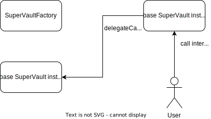
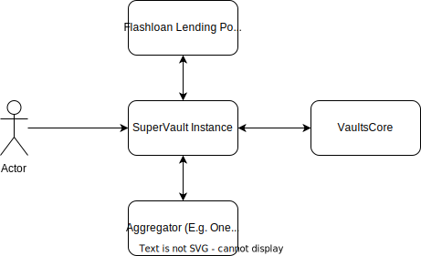

## User Interactions 

### Example Use Case
SuperVaults can be used to enter and manage positions as markets change. Let's say we start out by being very bullish on an asset (e.g. WETH).  We can first use a SuperVault to enter a leveraged long position using `leverage`. As the market shifts and we are no longer confident in the position, we can reduce risk through rebalancing to a less volatile collateral using `rebalance`. We can use `withdraw` at any time to withdraw our capital to use it elsewhere. Once we are done with our vault, we can use `emptyVault` to repay any outstanding debts for a particular vault and to take all collateral that was locked in the vault. 

### Depositing
`VaultsCore` enforces that only the owner of a vault can withdraw and borrow from a vault. Because of this, a vault managed by the `superVault` must be created through the `superVault` contract so that it has the correct access control rights to access the vault. Thus, to open a vault through the SuperVault contract, one of the following functions must be used:

- `depositToVault` 
- `depositAndBorrowFromVault`
- `depositETHToVault`
- `depositETHAndBorrowFromVault`

These functions only exist to give the `SuperVault`, the right access control, and thus take the exact same arguments as the functions from `vaultsCore` that they wrap around.

Note: Just like with `vaultsCore`, the deposited amount must be approved before calling any of the deposit functions. 

Note: We don't need to use one of the above functions with `leverage` since the `leverage`  function automatically creates a new vault with the right access control when called. 

### Withdrawing
Similarly to depositing, withdrawing must be done through using the `superVault` contract as an intermediary. `withdrawFromVault` simply wraps around the `withdraw` function in `vaultsCore`, and thus takes the same arguments as `withdraw` from `vaultsCore`.  

`withdrawAsset` can be used to claim all of any assets which aren't locked in vaults themselves (e.g. those earned through staking rewards). `withdrawAsset` takes one argument, the address of the asset to withdraw, and withdraws the total asset balance held by the contract. 

### Borrowing
Similarly to depositing and withdrawing, borrowing must be done through the using the `superVault` contract as an intermediary.  We can borrow from a SuperVault using `borrowFromVault`. This function simply wraps around the `borrow` method in `vaultsCore`, and thus takes the same arguments as `borrow` from `vaultsCore`.

### Leverage

SuperVaults allow for leveraging assets without any additional capital.

For example, let's assume we are very bullish on an asset we are holding (e.g. WETH), and we want to enter into a 3x long position. After initializing a SuperVault, we could call `leverage` on our SuperVault to do this. The steps required to leverage our WETH, assuming we start with 1 WETH, would be to:

1. Take a flashloan of the additional amount of WETH we want to leverage.  In this example, we want to leverage 3x, so we need to borrow 2 additional WETH to borrow from the flashloan.
2. Deposit the 3 total WETH (minus some flashloan fees) into a vault owned by the SuperVault contract 
3. From this newly deposited WETH, mint PAR. The MIMO protocol enforces that we can mint a maximum of `(Collateral Amount)/(Minimum Collateralization Ratio)` worth of PAR. The Minimum Collateralization Ratio (MCR) for WETH is 1.3, so we can mint a maximum of `(3)/(1.3)`, or about 2.3 WETH, worth of PAR.
4. Sell the newly minted PAR for WETH using an Aggregator (e.g. OneInch or Paraswap), and use the WETH to repay the flashloan + fees.  

Note: Given a starting amount `S`, the total amount of an asset that we can leverage depends on the MCR of the asset defined in `collateralConfig` . Specifically, the additional amount we leverage must be less than `S/(MCR - 1)`.
This is derived in the Leverage Max Amount Derivation section.

If the price goes up after we leveraged, we can take advantage of the price increase through withdrawing more PAR using `borrowFromVault`, or withdrawing more ETH through `withdrawFromVault`. If we wish cash out all of our leveraged ETH, we could use the `emptyVault` feature to: 
1. Take a flashloan to borrow some ETH. 
2. Swap the borrowed ETH to repay the outstanding debt in the leveraged vault.
3. Withdraw the leveraged ETH and repay the flashloan.   
If the price has increased, we will have more ETH than we initially started with after repaying the flashloan! See the `emptyVault` section for more details on how `emptyVault` is implemented.

The `leverage` function takes the following arguments: 
1.  `address asset` - The address of the asset to leverage
2.  `uint depositAmount` - The initial starting amount, e.g. 1 ETH
3.  `uint borrowAmount` - The additional amount to be leveraged, e.g. 2 ETH in the above example
4.  `uint parToSell` - The amount of PAR we need to sell to repay the leveraged amount
5.  `bytes dexTxData` - The bytes that will be passed to executeOperation to execute the aggregator Swap. This argument must be obtained by the aggregator APIs before calling the leverage function. 
6.  `enum aggregator` - The Enum, representing the aggregator to be used for selling PAR, either 0 (OneInch) or 1 (Paraswap)

### Rebalance

In addition to leveraging, SuperVaults also allow for rebalancing vaults to use another collateral without requiring any additional capital.

For example, let's assume that in our example from the previous section, our leveraged asset did not appreciate in the way we predicted, and ETH actually entered a bear market. To minimize our risk from our leveraged position, we could `rebalance` our SuperVault to use a less risky collateral, such as USDC. The `rebalance` call does the following:

1. Take a flashloan of the starting collateral - in this example, we are rebalancing ETH to USDC, so the starting collateral is ETH and the rebalanced collateral is USDC.  
2. Use an aggregator to swap the borrowed starting collateral for the rebalanced collateral.  
3. Deposit the rebalanced collateral into a new vault, and borrow PAR from the new vault
4. Use the borrowed PAR to pay back any outstanding debts on the starting collateral vault
5. Withdraw all starting collateral from the vault to repay back the loan

The amount of PAR we can borrow in step 3 is limited by the MCR of the rebalanced collateral. Thus, rebalancing is much more effective for moving to collaterals with lower MCRs as that will allow us to rebalance more collateral.

Note: Only vaults created by the SuperVault instance can be rebalanced.

The `rebalance` function takes the following arguments:
1. `uint vaultId` - The vaultId of the vault of the starting collateral; this can be obtained from `vaultsDataProvider`
2. `address toCollateral` - The address of the rebalanced collateral
3. `address fromCollateral` - The address of the starting collateral
4. `uint fromCollateralAmount` - The amount of starting collateral to deleverage
5. `uint parAmount` - The Amount of PAR that will be deposited to exchange for
6. `bytes dexTxData` - The bytes that will be passed to executeOperation that will execute the aggregator Swap; this argument must be obtained from the aggregator API.
7. `enum aggregator` - The Enum, representing the aggregator to be used for selling PAR, either 0 (OneInch) or 1 (Paraswap)

### EmptyVault

The `emptyVault` function can be used to once we are done using a vault for a specific collateral and we wish to repay all debts for the collateral and withdraw our collateral balance without any additional capital. 

Note: You should use `withdrawFromVault` instead if the vault you wish to close does not have any outstanding debt. 

The `EmptyVault` call does the following:

1. Flashloan some collateral
2. Use an aggregator to swap loaned collateral for PAR
3. Use swapped PAR to repay any outstanding vault debt
4. Withdraw collateral from vault

Note: There will likely be some leftover PAR from repaying the vaultdebt since we don't know exactly how much PAR we will get from a swap.  The vault will still technically exist after calling `emptyVault`; it will just have zero collateral balance and zero vaultdebt. 

### releaseMIMO
`releaseMIMO` can be used to release any earned MIMO from a supply miner to the `superVault` contract and send it to the user. 

`releaseMIMO` only takes one argument: 
1. `minerAddress` - The supply miner to release MIMO from 

## Technical Specifications

### Contract Initialization 
`SuperVault`s use the factory pattern to deploy clones as minimal proxy contracts, as [per EIP-1167](https://eips.ethereum.org/EIPS/eip-1167). This [results in gas savings ](https://blog.openzeppelin.com/workshop-recap-cheap-contract-deployment-through-clones/) as compared to deploying standalone instances . The `SuperVaultFactory` creates a new `SuperVault` clone for each user using a single uninitialized `SuperVault` contract as the base contract:

Note: `SuperVault` contract instances do not necessarily need to be initialized by their owner, they can be initialized on behalf of another owner by passing in the `owner` as a param. 

### User Interaction
Any subsequent interaction from the user is made to the `Supervault` clone through delegate calls to the base `SuperVault` contract:

### External Interactions 
The `SuperVaults` contracts link `vaultsCore` with a lending pool and aggregator contract to carry out vault operations: 

### Methods
In addition to the methods listed in the User Interactions section, the `SuperVault` contract defines additional methods to execute flashloans and organize code:
 
#### executeOperation
`executeOperation` is called automatically by the `lendingPool` contract after any flashloan is taken from the `leverage`, `rebalance`, and `emptyVault` methods. The `leverage`, `rebalance`, and `emptyVault` methods decode which type of operation must be executed after the flashloan is taken, and the `executeOperation` function routes execution to one of `leverageOperation`, `rebalanceOperation`, or `emptyVaultOperation` depending on the decoded data.  

`executeOperation` takes the following parameters, which are all passed in indirectly from the flashloan call:
1. `address[] calldata assets` An address array with one element corresponding to the address of the leveraged or rebalanced asset
2. `uint256[] calldata amounts` A uint array with one element corresponding to the amount of the leveraged or rebalanced asset
3. `uint256[] calldata premiums` A uint array with one element corresponding to the flashLoan fees
4. `address _`  Unused argument needed to integrate with the `flashloan` interface
5. `bytes calldata params` Bytes sent by the leverage or rebalance function that contains information on the aggregator swap

#### checkAndSendMIMO
Any operations that `repay` or `borrow` from `vaultsCore` may generate some MIMO rewards. This method is called in any `superVault` calls which generate MIMO rewards and send the rewards to the caller if there was any new reward. 

#### LeverageSwap
A helper function to avoid the `stack too deep` error in the `leverageOperation` function. This function just takes care of using an asset as collateral to borrow PAR from `vaultsCore`, and swapping the borrowed PAR for more of the asset. This function is only called internally from the `leverageOperation`  function. 

#### AggregatorSwap
A helper function to execute the logic of routing to an aggregator and executing a swap.

Before we swap using any aggregators, we must first obtain the low-level transaction data to call the aggregator contract with. This transaction data must be obtained from using the aggregator APIs.  The `requestHelper` file in the utils folder can be used to facilitate making these API calls. 

The `AggregatorSwap` function takes the following parameters:
1. `IERC20 fromCollateral` - The aggregator to use to swap
2. `uint256 amount` -  The starting token to swap for another asset
3. `uint256 flashloanRepayAmount` - The amount of starting token to swap for
4. `bytes memory params` - The low-level data to call the aggregator; obtained using the aggregator APIs 

#### TakeFlashLoan
A helper function to transform arguments to make the flashloan call from the lending pool. This function was added to simplify logic and reduce contract bytecode. 

### Leverage Max Amount Derivation

If we have a starting amount of collateral `S`, the Minimum Collateralization Ratio (MCR) of the collateral limits how much additional collateral `L` we can leverage:

After leveraging, we will have a total of `S+L` of collateral in our vault. The protocol enforces that we can borrow a maximum of `(S+L)/MCR` collateral's worth of PAR from our vault.

We will use this PAR to swap and repay the loan at the end of the leverage transaction, so the amount of PAR we withdraw must also be worth at least `L` collateral, neglecting flashloan fees (otherwise, we won't have enough to repay the loan) 

In other words, when we leverage the maximum amount of collateral, the amount of PAR we exchange must be simultaneously worth at most `(S+L)/MCR` of collateral (as dictated by the MIMO protocol) and at least `L` of collateral (as dictated by the flashloan protocol). Thus, we can set both expressions equal to each other to get the equation:

`(L+S)/MCR = L`

Solving the above equation for `L` gives us the maximum amount of additional collateral `L` we can leverage:

`L = S/(MCR - 1)`

We can additionally account for any flashloan fees by further dividing `L` by `1 + (flashloan fees)`.

For example, if we assume:
- We start out with 1 ETH; i.e. `S = 1`
- We want to leverage an additional 1 ETH; i.e. `L = 1` 
- The PAR/USD exchange rate is `1 PAR = 1.1 USD`  
- The ETH/USD exchange rate is `1 ETH = 3000 USD`
- The MCR for ETH is 1.3; i.e. `MCR = 1.3`

The protocol enforces that we can borrow a maximum of `(S+L)/MCR`, or `(1+1)/(1.3)`, or `1.54` ETH's worth of PAR from our vault. That works out to `(1.54 ETH) * (3000 USD / 1 ETH) * (1 PAR / 1.1 USD)` or `4200` PAR.

We will need to also have at least `1 ETH`'s worth of PAR to repay the flashloan. `1 ETH` works out to `(1 ETH) * ( 3000 USD / 1 ETH ) * (1 PAR / 1.1 USD)` or ~ 2727.27 PAR. 

Since the amount of PAR we can withdraw from our vault is higher than the amount of PAR we need to repay our loan, we can leverage this amount.

Assuming the above numbers, the maximum amount of additional ETH we could have leveraged was `S/(MCR-1)` or `(1 ETH)/(1.3 - 1)` or ~ 3.33 ETH. 