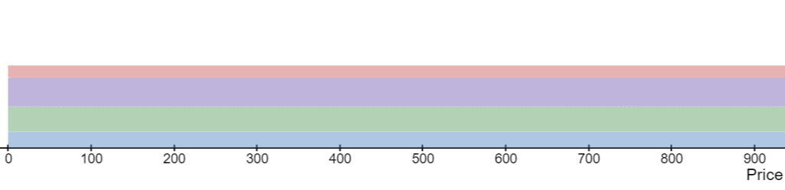

# Concentrated Liquidity Pools

Concentrated liquidity pools are a generalization of the traditional `xy = k` pool. With the traditional model all users provide liquidity on a `(0, inf)` price range where as in concentrated liquidity pools each user can pick their own range to provide liquidity on.
This allows users to narrow down the liquidity provision range which amplifies their liquidity - meaning traders experience lesser price impact and liquidity providers accrue more fees. The biggest tradeoff being liquidity providers experience greater impermanent loss.

## Representing global liquidity state

We represent the state of a pool's liquidity by using a linked list which starts at price 0 and ends at infinity. For every new position we insert two elements into the linked list based on the range's start and end price. To make the list more managable we limit the prices of the range to be some power of `1.0001`. E.g. our range can start at tick zero with a price of one `1.0000 = 1.0001^0` and end at tick 23028 which corresponds roughly to a price of ten. `10.0010 = 1.0001^23028`. With this approach we can cover the whole `(0, inf)` price range by using just `int24` as the exponent type.

The linked list is represented by a `int24 => Tick` mapping where the Tick struct holds a pointer to the previous and the next tick and the liquidity added amount amongst other things.

> We add a requierment that each position must start on an even and end on an odd tick. When we cross a tick this tells us weather we need to increase or decrease the current liquidity.

## Trading

Based on the **liquidity** variable wich tracks the current liquidity we can calculate the output and price impact of a trade. If the new price would cross into a new liquidity position or exit one we need to swap in steps instead.

For the first step we use the **nearestTick** variable to calculate the price of the next initialised tick that we are crossing. Based on the difference betwen this price and the current price we can calculate the swap amounts for the first step.

We then update the current price and current liquidity variables based on the tick that we just crossed and move the nearestTick pointer to the next one.

We repeat this step untill we use up all of the swap input amount.

## Fee accrual

Pool may be trading inside and outside of a given position. To calcualte fees belonging to a specific position we keep track of a couple of counters.

We store a **feeGrowthGlobal** accumulator which increases on every swap step by the swap fee amount divided by the current liquidity `feeGrowthGlobal += feeAmount / currentLiquidity`.
Every tick also keeps track of it's own **feeGrowthOutside** accumulator. This stores the fee growth that has happened on the side of the tick where trading isn't currently happening. It is updated each time a tick is crossed: `feeGrowthOutside = feeGrowthGlobal - feeGrowthOutside`.

Using the `feeGrowthGlobal` and `feeGrowthOutside` variables we can calculate the feeGrowth that has happened above or below any specific tick.

Using the `feeGrowthAbove` of a range's upper tick and the `feeGrowthBelow` of the range's lower tick we can calculate the current fee growth of a position by subtracting both values from the current `feeGrowthGlobal`. When a user adds a position a snapshot of this value is stored in the **feeGrowthInsideLast** variable. When the user wants to claim their fees a new `feeGrowthInsideLast` value is calculated. Multipliying the difference between the new and the old value with the position's liquidity gives us the fees belonging to the user.

## Pool Manager

Users can chose for their liquidity position to be owned by the `ConcentratedLiquidityPoolManager` contract. Doing so will mint them an NFT position which will have the claim to the underlying tokens and to any accrued fees. The pool manager also acts as a staking contract for liquidity mining. Users can use their NFT positions to subscribe to several incentives with their NFT positions.

## Key state variables

| Concentrated liquidity pool |                                                                                                          |
| --------------------------- | -------------------------------------------------------------------------------------------------------- |
| liquidity                   | Current liquidity. Used to calculate price impact.                                                       |
| price                       | Square root of the current price in terms of token1, multiplied by 2^96. Used to calculate price impact. |
| feeGrowthGlobal{0,1}        | Swap fee accumulator; fees are divided by the liquidity for the swap                                     |
| nearestTick                 | Pointer to the tick that is just below the current price.                                                |
| reserve{0,1}                | BentoBox share balance of the pool for token0 and token1.                                                |
| ticks                       | (int24 => Tick) mapping for the linked list. Used to update current liquidity when crossing ticks.       |
| positions                   | (address => (int24 => (int24 => Position))) mapping. Used to keep track of a user's liquidity position.  |

## Formulas

Calculating price impact:

- Δ√𝑃 = Δy / L
- Δ(1/√𝑃) = Δx / L

> Where x is token0 and y is token1

Calculating liquidity:

- L = Δy / Δ√𝑃
- L = Δx / (1/Δ√𝑃)

Calculating amounts:

> E.g. calculating user's token0 and token1 amounts when burning liquidity based on their lower and upper range price and their liquidity amount.

- Δx = Δ(1/√𝑃) · L

> Where √𝑃 is derrived from the price span that is above the current price.

- Δy = Δ(√𝑃) · L

> Where √𝑃 is derrived from the price span that is below the current price.
