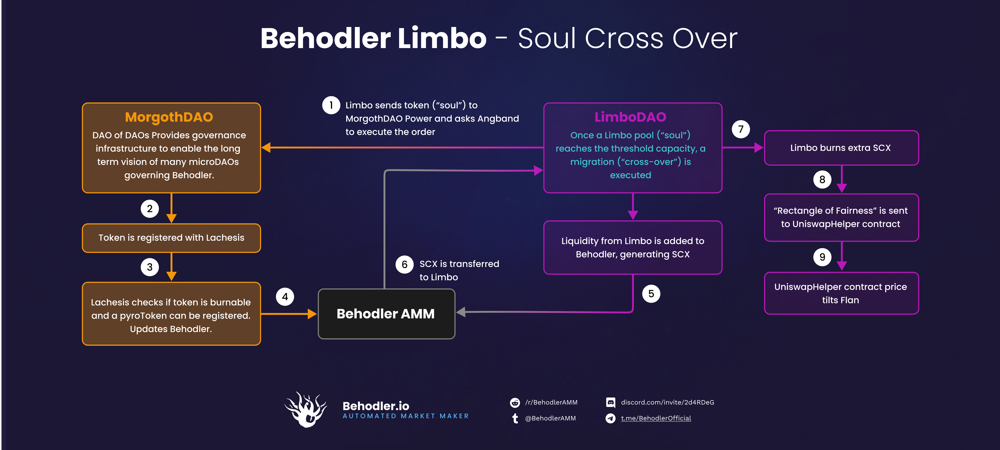

# Behodler Liquidity Protocol :space_invader:
---
:milky_way: [behodler.io](https://behodler.io)

:bird: [@behoderamm](https://twitter.com/BehodlerAMM)

:book: [docs](https://docs.behodler.io)

:pager: [discord](https://discord.gg/nBHvfYeg)


# Behodler contest details ✨
- $85,500 USDC main award pot
- $4,500 USDC gas optimization award pot
- Join [C4 Discord](https://discord.gg/code4rena) to register
- Submit findings [using the C4 form](https://code4rena.com/contests/2022-01-behodler-contest/submit)
- [Read our guidelines for more details](https://docs.code4rena.com/roles/wardens)
- Starts January 27, 2022 00:00 UTC
- Ends February 2, 2022 23:59 UTC

# Team Contacts

Team members can be reached on the [C4 Discord](https://discord.gg/code4rena):

- Justin Goro#1527
- Arren#0352
- Wiggum#1287

Feel free to drop us a message whenever necessary.

---

# Table of Contents

- [Behodler contest details ✨](#behodler-contest-details-)
- [Team Contacts](#team-contacts)
- [Table of Contents](#table-of-contents)
- [Scope](#scope)
	- [Video](#video)
	- [Contracts in scope:](#contracts-in-scope)
	- [Areas of Concern](#areas-of-concern)
		- [DAO](#dao)
	- [> :heavy_exclamation_mark: **However, it's important that Pyrotokens and Scarcity can be listed as perpetual souls without issue.**](#-heavy_exclamation_mark-however-its-important-that-pyrotokens-and-scarcity-can-be-listed-as-perpetual-souls-without-issue)
- [Context: The Behodler Ecosystem](#context-the-behodler-ecosystem)
	- [The Behodler ecosystem at a glance](#the-behodler-ecosystem-at-a-glance)
	- [The economic challenges of single sided token listing](#the-economic-challenges-of-single-sided-token-listing)
	- [The security challenges of listing tokens on a single sided AMM with a single pool of liquidity](#the-security-challenges-of-listing-tokens-on-a-single-sided-amm-with-a-single-pool-of-liquidity)
		- [Fakecoin](#fakecoin)
		- [Early Bird attack](#early-bird-attack)
	- [Reward token](#reward-token)
	- [Flan and Scarcity](#flan-and-scarcity)
		- [Version 1: Crowdfunding](#version-1-crowdfunding)
		- [Version 2: Migrate and burn](#version-2-migrate-and-burn)
		- [Version 3: Flan minting](#version-3-flan-minting)
		- [Version 4: Price tilting](#version-4-price-tilting)
		- [Version 5: Stable Flan](#version-5-stable-flan)
		- [Version 6: Lockup incentives](#version-6-lockup-incentives)
	- [Governance](#governance)
- [How to run local unit test](#how-to-run-local-unit-test)
- [Limbo Smart Contracts Overview:](#limbo-smart-contracts-overview)
	- [Technical Reference](#technical-reference)
		- [Contract Inheritance](#contract-inheritance)
		- [Contract Dependencies](#contract-dependencies)
		- [External Libraries](#external-libraries)
		- [Testing](#testing)
			- [How to run local unit tests](#how-to-run-local-unit-tests)
- [Limbo Smart Contracts:](#limbo-smart-contracts)
		- [Flan](#flan)
		- [FlanBackstop](#flanbackstop)
		- [Limbo](#limbo)
			- [How is Limbo different from other liquidity mining dapps?](#how-is-limbo-different-from-other-liquidity-mining-dapps)
			- [Primary incentive for staking:](#primary-incentive-for-staking)
			- [Economics:](#economics)
			- [Nomenclature:](#nomenclature)
			- [Basic staking incentives:](#basic-staking-incentives)
			- [Late stakers considerations:](#late-stakers-considerations)
			- [Crossing incentives:](#crossing-incentives)
			- [States of migration:](#states-of-migration)
			- [Flash governance:](#flash-governance)
			- [Rectangle of Fairness:](#rectangle-of-fairness)
		- [TokenProxyRegistry](#tokenproxyregistry)
		- [UniswapHelper](#uniswaphelper)
	- [LimboDAO Smart Contracts](#limbodao-smart-contracts)
		- [FlashGovernanceArbiter](#flashgovernancearbiter)
		- [Governable](#governable)
		- [LimboDAO](#limbodao)
		- [ProposalFactory](#proposalfactory)
	- [Proposal Smart Contracts](#proposal-smart-contracts)
		- [BurnFlashStakeDeposit](#burnflashstakedeposit)
		- [SetAssetApprovalProposal](#setassetapprovalproposal)
		- [ToggleWhitelistProposalProposal](#togglewhitelistproposalproposal)
		- [UpdateMulitpleSoulConfigProposal](#updatemulitplesoulconfigproposal)
		- [WithdrawERC20Proposal](#withdrawerc20proposal)
	- [Additional Information](#additional-information)
		- [LimboDAO Proposal Definition](#limbodao-proposal-definition)
		- [Proposals in this repo](#proposals-in-this-repo)
		- [LimboDAO Proposal Life Cycle](#limbodao-proposal-life-cycle)
			- [Community Consent](#community-consent)
			- [Whitelisting](#whitelisting)
			- [Parameterization](#parameterization)
			- [Lodge](#lodge)
			- [Vote](#vote)
			- [Decision](#decision)


---

# Scope

The focus of this contest is to look for any logic errors, exploits or attack vectors that would otherwise impact the users of Limbo. 

Limbo is a critical component of the Behodler Liquidity Protocol, as it serves as the token pre-seeding layer before a token is added for trading on Behodler AMM. 

Smart contracts are listed in alphabetical order per module and not in order of importance.

## Video
We have a comprehensive youtube playlist recorded by our lead dev which covers:
	1. High level overview, motivating and explaining the core concepts and cryptoeconomics
	2. A dive into the code base

https://www.youtube.com/watch?v=EEYO0zI3K2c&list=PLmf60JxYYfEvC-_laKFUqKbOrMcz_RQKN&index=1

*Technical note: the video will play in your browser but may take a minute to load.*

## Contracts in scope:

| Module    | Contract Name                     | sLoc | Priority |
| :----     | :-------                          | :----| :----    |
| Limbo     | Flan                              | 80   | Medium   |
| Limbo     | FlanBackstop						| 75   | Low      |
| Limbo     | Limbo                             | 553  | High     |
| Limbo     | TokenProxyRegistry                | 14   | High     |
| Limbo     | UniswapHelper                     | 191  | High     |
| LimboDAO  | LimboDAO                          | 330  | High     |
| LimboDAO  | FlashGovernanceArbiter            | 109  | Medium   |
| LimboDAO  | Governable                        | 48   | Medium   |
| LimboDAO  | ProposalFactory                   | 50   | Low      |
| Proposal  | BurnFlashStakeDeposit             | 39   | Medium   |
| Proposal  | SetAssetApprovalProposal          | 20   | Low      |
| Proposal  | ToggleWhitelistProposalProposal   | 26   | Low      |
| Proposal  | UpdateMulitpleSoulConfigProposal  | 67   | Medium   |
| Proposal  | WithdrawERC20Proposal             | 27   | Medium   |

## Areas of Concern
The main areas of concern are the consensus mechanisms of LimboDAO and of the migration mechanics of Limbo.

### DAO
Any contract which wishes to be governed by LimboDAO must implement the Governable interface. This enables the use of proposal based governance and flash governance. A proposal is a smart contract which performs some governance action. The onlySuccessfulProposal modifier allows developers to guard a public or external function from execution by anything other than a proposal which has been voted successful. 
Once executed, the proposal is returned to a dormant state so that if it attempted to execute a function decorated with onlySuccessfulProposal, it would fail.

Voting happens on chain. Rather than directly measuring currently staked governance tokens, potential voters earn voting points called Fate. These points can be spent on voting. This rewards users for duration in addition to size. To further promote equality, Fate is earned quadratically.

Instead of voting, users can choose to rather burn the governance token. This yields a much higher value of Fate and isn't subject to quadratic dynamics. In other words, burning is the option of last veto resort for whales.

The main concern with proposals is simply knowing that they're safe and don't open up attack vectors beyond democratic takeover. It's also important to know that there isn't a sneaky way to award yourself infinite Fate from an unchecked overflow or something like that.

Flash governance refers to functions which need to be guarded but can benefit from rapid execution rather than long voting periods. For example, if the public becomes aware of a vulnerability in Limbo, the disable() function can be called via flash governance instantly.
In order to execute a flash governance function, the user must put up a large quantity of EYE. The EYE is locked for a duration long enough for the community to deliberate on whether the flash decision was for the best. If not, the community can burn the staked EYE. I'm concerned about EYE locking bugs that have people losing their EYE deposits permanently. 

Flash decisions are limited to a certain quantity per epoch to prevent Karen attacks. Individual addresses also have limitations on the frequency of flash governance calls.

The main concern here is that all the incentive loops have been closed. Governance consensus is a game theory dance and what we want to avoid is stable equilibriums that lead to poor outcomes.

On the Limbo side, migration of a token to Behodler is fairly complicated. One of the functions of the migration module is to nudge the price of Flan towards Dai parity. This relies on the concept of price tilting. Are there migration edge cases that haven't been thought of? Is there some reason we should expect Flan to diverge permanently from parity?

If you can successfully attack either the governance or the migration system, this info would be highly valued. We're not interested in identifying dodgy tokens as an attack vector. Limbo token listing isn't permissionless and we won't be listing tokens that deviate from expected norms and what Behodler can handle.

> :heavy_exclamation_mark: **However, it's important that Pyrotokens and Scarcity can be listed as perpetual souls without issue.**
---

# Context: The Behodler Ecosystem

## The Behodler ecosystem at a glance

The easiest way to understand a new dapp is to iterate your comprehension over the entire sum of parts multiple times, each time adding more detail to each part. For instance, if you approached Bitcoin for the very first time, rather than learning what Adam Back's hashcash algorithm is, you'd probably first just want to settle on the idea that Bitcoin is scarce digital money issued by no central authority. On the next pass, you can unpack those terms. Eventually you'll have to flesh out what mining is and eventually that will lead to an understanding of proof of work. Along the way you'll intersect with philosophies about what money is and end up opening a thousand browser tabs on central banking.

I suggest the same approach to understanding Limbo. This first section will look at Limbo from the top level of how it fits into the Behodler ecosystem. The next section will motivate Limbo's existence and in the process you'll learn why and how it works conceptually and how this relates to the reward token, Flan.

The final parts will unpack the purpose of each contract. From there you'll be ready to dive straight into the code base and read the Natspec compliant per-function comments, all the while knowing where the contract you're reading fits in with the broader picture.

Let's get going with a bird's eye view of the Behodler ecosystem.

At the highest level, Limbo is a yield farming dapp. Stakers of liquidity are rewarded with newly minted Flan token. Flan is issued on a per second basis, similar to Sushi and CRV.

Here's where Limbo differs from other yield farms: Most yield farms are designed to encourage lockup in an accompanying AMM via pairs. The primary purpose of Limbo is to crowdfund potential tokens to be listed on the Behodler AMM. A useful analogy would be the original Sushi Masterchef contract. Sushi was paid to stakers of Uniswap LP tokens. Eventually the tokens were migrated to the new Sushiswap AMM.

The difference here is that the Behodler AMM (henceforth Behodler) already exists. So why the stake and migrate? Why not just stake straight into Behodler to start with? 

Behodler is a single contract pool of liquidity. It does not operate on pairs. What this means is that new tokens listed must arrive with reserves equal in value to the average token already listed. The reasons for this are discussed in a deeper dive below. But essentially, as liquidity grows on Behodler, the minimum capital requirement for new tokens grows as well. 

So coming back to Limbo, for a prospective new token, we need to raise a threshold of capital. Limbo offers staking incentives in the form of Flan payments to encourage users to provide the desired token. When the staked quantity surpasses a threshold, it is all migrated to Behodler and listed as tradeable. 


Like other AMMs, Behodler issues a liquidity token. Because all liquidity is pooled in one contract, Behodler issues a universal liquidity token called Scarcity (SCX). SCX can be redeemed for liquidity on Behodler and fetches an external market price on other AMMs.

When Limbo migrates new tokens to Behodler, it generates SCX. This SCX is used to prop up the value of Flan on an external AMM. In this way, the value of Flan is backed by the liquidity of Behodler.

One of the tricks to running Limbo is to ensure that the increase in supply from newly minted Flan is outweighed by the demand for Flan created by newly minted SCX on Behodler. There is a system of incentives in place to ensure that is indeed the case but many variables need to be tweaked on an ongoing basis. For this and other reasons, Limbo is accompanied by its own fine-tuning DAO called LimboDAO. The Behodler ecosystem has a universal governance token called EYE. EYE is the token of governance for LimboDAO as well. If Limbo operates well, the entire ecosystem thrives. As such, EYE holders have it in their best interest to correctly calibrate Limbo via LimboDAO such that the incentive loops are all sustainable.

Limbo is therefore a fully decentralized, community governed yield farm.

The entire Behodler ecosystem is overseen by a DAO of DAOs called MorgothDAO. Each dapp gets its own DAO. When Limbo wants to list a new token on the AMM, it needs to ask MorgothDAO for permission. This process is quick but MorgothDAO has the ultimate say, a little like a supreme court.

The next section motivates Limbo more thoroughly and ties together the tokenomics so that the nature of Flan as it relates to SCX and Behodler becomes clearer. Here you'll encounter the security challenges and architectural motivations that will certainly help in picking apart the code base.

If you're content with the top level overview and wish to jump into a contract by contract overview, skip to [Limbo Smart Contracts](#limbo-smart-contracts)

## The economic challenges of single sided token listing

Behodler is a single sided AMM with a single pool of liquidity. This means that when you add liquidity, you only add one token at a time, rather than in a pair. For pair based AMMs, tokens must be added in a ratio that reflects their relative price. For instance, if the market price of Eth is 4000 USDC then creating a USDC/WETH pair requires adding tokens to the pair in a ratio of 4000 USDC for every 1 WETH. Adding in any other ratio creates arbitrage opportunities which vigilant traders and bots can exploit. The result is a transfer of wealth from the depositor to the trader in the form of instant impermanent loss.
For Behodler, tokens also need to be added in the correct ratio but unlike in Pair based AMMs, there is already a set of tokens with pre-existing liquidity. When listing a new token to Behodler, the incoming token must be added in the same ratio to the other tokens such that market prices are maintained AND it has to be added with the same value of liquidity. Suppose that Behodler has 3 tokens listed: Aave, Dai, Uni and Weth. The dollar prices are $300, $1, $2000 and $4000 respectively. Now let's add Sushi with a market price of $30. We know then that the quantity of Sushi should be 10 times the quantity of Aave liquidity, 1/30th times the Dai liquidity, 67 times the Uni and 133 times the Weth liquidity.
This means that if there is say 100,000 Dai at rest then we require 3333 Sushi to be listed.
As the liquidity on Behodler rises, the minimum requirement for new tokens listings rises as well. Beyond some point, it becomes infeasible for individuals to raise the requisite liquidity unilaterally. This is where a liquidity crowdfunding dapp comes in.

## The security challenges of listing tokens on a single sided AMM with a single pool of liquidity
AMMs on Ethereum almost universally operate under the premise of segregated liquidity. The most common instance of this is the token pair Uniswap model where tokens pairs are stitched together with a system of both contact and front end routing. some AMMs extend the number beyond 2 such as Balancer and Curve but there the limit is never significantly higher than 2. 

### Fakecoin

From a security perspective, a token pair (or pool) contract can be thought of as a micro exchange. If something goes wrong in the pair because of the misbehaviour of one of the tokens, the damage is contained to a handful of tokens and the providers of that liquidity. For instance, suppose a token pair exists on Uniswap between Dai and a fictional token Carpet. Carpet gives the deployer of the Carpet contract unlimited minting power. However, this feature is overlooked during a typical hypecycle and many holders of Dai are drawn in and begin adding liquidity to the pair. At some point, the Carpet admin mints a huge amount of Carpet and effectively drains the pair of Dai. From here they may attempt to spread their damage elsewhere but the rugpull has effectively set the price of Carpet to zero so the rest of Uniswap is now under no influence from Carpet. The owner only has the stolen Dai which is a legitimate token and so spending it elsewhere on Uniswap does not spread any contagion. This is what allows Uniswap to accept permissionless creation of token pairs.

If the attack were conducted on a Balancer pool that contains 7 other tokens then the damage is more extensive as the infinite mint of Carpet would lift the liquidity on 7 types of tokens.
For Behodler, such a fakecoin attack would allow an attacker to plunder the entire AMM. Any token added on Limbo would have to be scrutinized and audited for Behodler attack vectors before being migrated.

Limbo offers a token proxy registry that allows the wrapping of problematic tokens into proxy tokens that behave well on Behodler. This is the first step to allowing permissionless (or at least very low barrier) listing of new tokens both on Limbo and Behodler. As the dapp matures, the list of proxy types will expand and the need for deep audits of every new token listed will decline.

### Early Bird attack
In any AMM, token reserve ratios must reflect their relative price. If Eth is worth 4000 dai and you're aiming to add 6 Eth to a pair then you need to add 24000 Dai in order to avoid losing Eth to an opportunistic arbitrage bot. The same is true of Behodler but unlike Uniswap pairs which can be initiated with minimal liquidity and later added to, Behodler has pre-existing liquidity that must be matched. Beyond some prohibitively high level of liquidity, adding new token listings requires collective capital pooling. Limbo is the crowdfunding mechanism that coordinates this pooling through a game theoretically compelling rewards system presented as a familiar yield farming experience.

There is an attack vector peculiar to Behodler that inspired the creation of the Flan token in particular. Scarcity is the liquidity token on Behodler but it is priced differently to traditional liquidity tokens. Whereas a standard LP token is a simple share on reserves, Scarcity is a claim on the marginal value of the next trade. SCX is priced along a logarithmic curve that represents one half of a constant function AMM swap. The mathematical derivation can be found in the white paper (https://docs.behodler.io/further-reading/whitepaper). What this means is that the price of SCX is proportional to the existing liquidity on Behodler and that the curvature of this function is quite dramatic. For instance, adding the first unit of a token to Behodler will generate about 366 SCX. The next unit will only generate 24 SCX. When all liquidity is balanced on Behodler, the discrepancies between SCX generated by various tokens is not disruptive but when there's a large imbalance then the SCX generated by correcting the imbalance has a market price far in excess of the liquidity added. 
To take an extreme example, suppose we want to list a new dollar stablecoin on Behodler with 18 decimal places and suppose the current market price of SCX is $100. If we list the stablecoin and add 1 unit of it, we receive 366 SCX which means than in dollar terms, we've spent $1 and received $36,600 worth of SCX. If a second user adds the next unit, they receive 24 SCX which is $2400, still far above the cost of adding but clearly there's an inequality of reward that needs to be smoothed over. Perhaps if we flatten then inequality between users, the value added will match the SCX generated. A solution to this problem is discussed further in the following section but a digression on staking mechanics is first required.

## Reward token
The nature of the staking reward token on Limbo is unique in the yield farming space and understanding the cryptoeconomics behind its value will assist in understanding the motivation behind the various modules of logic found throughout Limbo.

The most common technique for legitimate liquidity mining is to issue the governance token of the platform as a staking reward. The issuance can either be from a fixed pool, implying a finite mining period, or from unlimited linear inflation such as with Sushi and Curve. This latter class is more interesting as it requires a demand base to be constantly growing to offset the unlimited inflation. In other words, sustainable mining necessitates the need not just for a market but for an economy. 

Economies have a subtle, circular quality to them in the form of feedback loops. To take the example of Curve.fi, the governance token is issued as an additional reward for pooling liquidity. As an AMM, Curve users experience quadratic benefits from increased liquidity. That is, for every $2 of liquidity added, the Curve ecosystem benefits by approximately $4. The Curve token is minted without limit which would lead one to expect its value to decline to zero over time. However, the governance token is the voting power required to create new token pools. Prospective projects have an incentive to bid up demand for CRV. To the extent that this increases the CRV price, the rewards for mining increase which brings in more liquidity, increasing the value to all users and projects listed on Curve which creates further demand for CRV in order to partake in the networked economic bounty. The result is perpetual demand for CRV. which outstrips supply so that the mining rewards are sustainably permanent.
This is the fundamental principle explaining the governance token economy in DeFi.

Most consumers of DeFi and finance in general are vaguely aware of the circularity of economies but do not have a fleshed out mental model or a set of axioms with which they can use to scrutinize the sustainability of a prospective DeFi economy. Instead, they rely on heuristics and familiar marketing language to identify cryptoeconomies. The fuzzy realm between reality and perception where human-powered pattern recognition is the primary filter for profit opportunities is where all rugpulls live.

Limbo does not use a governance token to create a sustainable economy but the token issued is an infinite mint token like Sushi and Crv and so it's important to understand how the loop is closed on sustainability without the traditional governance/reward token model.

## Flan and Scarcity
The easiest way to understand the value of the reward token, Flan (FLN), is to conceptually iterate over potential versions of Limbo until we arrive at the final version.

### Version 1: Crowdfunding
Suppose we write a contract that gathers deposits for a new token listed on Behodler. A threshold is specified that equals the existing AVB on Behodler. Sticking with the stablecoin example, we determine that the average value of reserve liquidity (AVB) on Behodler is $5000. 4 users send in their tokens and about 600 SCX is generated. The 600 is then distributed in direct proportion to the quantities sent in by each user. 
We know from the bonding curve logic that these numbers imply a price for Scarcity of about $200. This means that the market value of the SCX generated is (200x600) = $120000, well in excess of the AVB of $5000.

Another problem emerges: because of the nature of SCX, a unit of SCX does not represent a dollar value but a proportion of existing liquidity. This means that the same fixed units of SCX will redeem the same proportion of reserve liquidity. For instance, 18 SCX is enough to redeem half of the reserve for a given token, no matter the initial reserve number. 25 SCX is about the sum required to empty a bonding curve entirely. So while the simple SCX crowdfunding model increases fairness, it doesn't resolve the issue of too much SCX being minted.

### Version 2: Migrate and burn
This is the same as version 1 but the SCX generated by the addition of the new token is mostly burnt. Since 25 SCX is enough to redeem a bonding curve, only 25 SCX is held back. The remaining 575 SCX is burnt. The 25 SCX is then distributed to the crowdfunding users.

This solves the problem of SCX-value mismatch but the user experience of providing liquidity and then waiting for potential rewards that may not come, depending on the popularity of the pool, suffers in comparison to tradition yield farm experiences that issue reward tokens immediately upon staking.

### Version 3: Flan minting
Here, we immediately issue a reward token (Flan). Upon successful token migration, the SCX generated is used to buy Flan on an external AMM such as Uniswap. If we use the entire SCX, we undermine the price of SCX by releasing too much onto the market. However, the swap curve on Uniswap does ensure that the SCX will become increasingly difficult to acquire because of slippage. What this means is that we again need to burn most SCX but probably not as much as before, giving us a bit of leeway to boost the price of Flan. 

In order to create sufficient incentives to stake, we need to pay users on an ongoing basis during the staking phase. In addition, we need to compensate them for having their tokens migrated to Behodler. If we do not compensate them as close to the market value of the token as possible then we can't attract the final users required to push the pool over the threshold.

So it would appear that for Y dollars of a token listed on Limbo, we require more than Y dollars of Flan. However, we have only a little more than Y dollars of SCX from migration with which to boost the price of Flan. Given infinite minting, the price of Flan will slowly decline and we'll end up with an unsustainable economy. This assumes the price of SCX remains stable. If the utility of Flan and Behodler is enough to raise liquidity on Behodler then the incremental price boosts from SCX generated during migration will be enough to see demand for Flan surpass supply growth. 
However, the liquidity of Flan is not being affected by each migration so unless users voluntarily add liquidity to a Flan/SCX pair on an external AMM, the price movements of Flan between migrations will be volatile, creating uncertainty around mining incentives.

### Version 4: Price tilting
Uniswap version 2 and its forks all price swaps as the current ratio of liquidity at the time of the trade. The prior history of trades has no impact on the current price. The reason trading alters the price is because it alters the ratio of reserves. This means that the price can be set merely by setting the ratio of liquidity. For instance, suppose a pair exists with 10 Dai and 10 USDC. This implies a price of 1. Now send 5 Dai and 20 USDC to the pair so that the reserves are now 15 Dai and 30 USDC. This immediately implies a price of 1 Dai = 2 USDC. This is the principle of *price tilting*.

When a migration on Limbo occurs, a quantity of SCX is generated. If we keep back 25 SCX then we can buy a value of Flan on the open market equal to approximately the value of the AVB of Behodler and no dilution of SCX will occur. However, we can use price tilting to effectively double the value created. Suppose that instead of buying Flan with SCX, we sample the price of Flan in terms of SCX and mint it. For instance, suppose the Uniswap price of Flan is 0.1 SCX. Then at the point of migration, we mint 250 Flan in response to the 25 SCX generated from migration. We then send those 2 quantities to the Flan/SCX Uniswap pair. The liquidity of Flan/SCX has now increased by twice the AVB of Behodler and no SCX dilution has occurred. This provides a far greater runway of Flan minting available to issue as rewards for the subsequent migration. So long as the value of Flan distributed between migrations is less than than twice the AVB of Behodler, we can expect a degree of sustainable minting. The curvature of Uniswap provides some additional price protection.

### Version 5: Stable Flan
When issuing a reward token, the more stable the reward token in price, the more predictable rewards and therefore the more likely marginal stakers are to ape in. Most yield farms suffer from the need to create a token that grows in price which implies a certain level of volatility. By decoupling Flan from governance, Limbo can be designed in such a way that Flan converges on being a dollar stable coin. To do this, at the point of migration, we require an oracle sampling of the Dai/SCX price and the SCX/Flan price. We then mint Flan sufficient to set the ratio of SCX/Flan such that Flan will approximately equal 1 Dai. Since Flan is intended to boost the price of SCX, this implies that every successive migration will see more Flan minted for price tilting than in the previous migration. The end result will be not only make for a more user friendly reward token but one with fast growing liquidity.
Flan backed by large liquidity pool means that more of it can be minted for rewards which acts to boost the rest of the Behodler ecosystem which is reflected as a higher SCX price which in subsequent migrations leads to increased Flan liquidity depth.

### Version 6: Lockup incentives
In addition to the positive feedback loops of token migrations, Limbo offers traditional staking pools. These can be used to both curtail the circulating supply of Flan and to boost demand for Flan. For instance, a Flan pool with an attractive APY will lead to Flan lockup. PyroFlan is a natural hold incentive on Flan and as Flan converges on stablecoin status, PyroFlan will become a thriftcoin, a stablecoin with positive yield.
A pool on PyroFlan would provide a free source of APY on Flan locked in Limbo. However offering a Flan reward on a Uniswap pool of PyroFlan/SCX or PyroFlan/(stablecoin) would lead to an increase lockup of PyroFlan across two AMMs and would lead to PyroFlan burning from increased trade activity which itself would add to the APY of an accompanying PyroFlan pool on Limbo and act to lock flan in the PyroFlan reserve. 
Finally, the convergence on Dai parity creates fertile soil for concentrated liquidity trading of Flan with other stablecoins. Uniswap 3 pools of Dai, USDC, USDT, MIM, OUSD etc coupled with Flan will cement the stablecoin status of Flan. Since LimboDAO can arbitrarily mint Flan, at this point it may be worth minting a great deal of Flan in order to bribe CRV holders to list Flan on Curve.

## Governance
The Behodler ecosystem subscribes to two philosophies of responsible governance:
1. Gradual decentralization 
2. Subsidiarity

The metaphor of Morgoth was chosen to illustrate the nature in which power would spread to the edges. MorgothDAO maps privileges (called powers) to addresses. Initially all these powers were vested in one user (Melkor) who was the deployer of the DAO. But these powers can be assigned to minions of Morgoth. These minions can be externally owned accounts or contracts. The reason we don't want to throw all power into a token weighted democracy is that security would be undermined. Specifically, if tokens listed on Behodler were subject to simple voting, then a majority EYE holder could vote on a fakecoin designed to drain the AMM. Some DAOs get around this by giving the team a super majority of tokens but this is a tacit admission that the consensus model is insecure. For Behodler token listing, it makes sense to run the tokens through a judicial process (eg. Kleros) whereas for Limbo, constrained voting will probably bubble up the preferences of the users most effectively. Which brings us to subsidiarity.

Subsidiarity refers to a devolution of power structures. Instead of one DAO with one form of consensus making all decisions, each dapp would get it's own micro DAO responsible for the majority of operations. An overarching DAO would act as a backstop of authority. To use a familiar nation state analogy, MorgothDAO is the Federal Government and LimboDAO is a state legislature. Each microDAO would be designed to fit the task at hand.


---

# How to run local unit test
The tests are written against Hardhat.
Simply install all packages and test:

```
yarn && yarn test
```

# Limbo Smart Contracts Overview:

## Technical Reference

### Contract Inheritance
| Module  | Contract Name                    | File Name                           | Inherits From             | Implements Abstract   | Implements Interface  | 
| :----   | :-------                         | :----                               | :----                     | :----                 |:----                  |
| Limbo   | Flan                             | Flan.sol                            | ERC677                    | Governable            |                       |
| Limbo   | Limbo                            | Limbo.sol                           |                           | Governable            |                       |
| Limbo   | TokenProxyRegistry               | TokenProxyRegistry.sol              |                           | Governable            |                       |
| Limbo   | UniswapHelper                    | UniswapHelper.sol                   |                           | Governable,AMMHelper  |                       |
| Limbo   | FlanBackstop                     | FlanBackstop.sol                    |                           | Governable            |                       |
| LimboDAO| LimboDAO                         | LimboDAO.sol                        | Ownable                   |                       |                       |
| LimboDAO| FlashGovernanceArbiter           | FlashGovernanceArbiter.sol          |                           | Governable            |                       |
| LimboDAO| Governable                       | Governable.sol                      |                           |                       |                       |
| LimboDAO| ProposalFactory                  | ProposalFactory.sol                 | Ownable                   | Governable            |                       |
| Proposal| BurnFlashStakeDeposit            | BurnFlashStakeDeposit.sol           |                           | Proposal              |                       |
| Proposal| SetAssetApprovalProposal         | SetAssetApprovalProposal.sol        |                           | Proposal              |                       |
| Proposal| ToggleWhitelistProposalProposal  | ToggleWhitelistProposalProposal.sol |                           | Proposal              |                       |
| Proposal| UpdateMulitpleSoulConfigProposal | UpdateMulitpleSoulConfigProposal.sol|                           | Proposal              |                       |
| Proposal| WithdrawERC20Proposal            | WithdrawERC20Proposal.sol           |                           | Proposal              |                       |


### Contract Dependencies
| Module  | Contract Name                    | File Name                          | Libraries 									 | External Contract Calls           |
| :----   | :-------                         | :----                              | :----                                        | :----                             |
| Limbo   | Flan                             | Flan.sol                           |                                              |                                   |
| Limbo   | Limbo                            | Limbo.sol                          | SoulLib, CrossingLib, MigrationLib, SafeERC20|                                   |
| Limbo   | TokenProxyRegistry               | TokenProxyRegistry.sol             |                                              |                                   |
| Limbo   | UniswapHelper                    | UniswapHelper.sol                  |                                              | UniswapV2 Factory, UniswapV2Pair  |
| Limbo   | FlanBackstop                     | FlanBackstop.sol                   |                                              |                                   |
| LimboDAO| LimboDAO                         | LimboDAO.sol                       | TransferHelper                               |                                   |
| LimboDAO| FlashGovernanceArbiter           | FlashGovernanceArbiter.sol         |                                              |                                   |
| LimboDAO| Governable                       | Governable.sol                     |                                              |                                   |
| LimboDAO| ProposalFactory                  | ProposalFactory.sol                |                                              |                                   |
| Proposal| BurnFlashStakeDeposit            | BurnFlashStakeDeposit.sol          |                                              |                                   |
| Proposal| SetAssetApprovalProposal         | SetAssetApprovalProposal.sol       |                                              |                                   |
| Proposal| ToggleWhitelistProposalProposal  |ToggleWhitelistProposalProposal.sol |                                              |                                   |
| Proposal| UpdateMulitpleSoulConfigProposal |UpdateMulitpleSoulConfigProposal.sol|                                              |                                   |
| Proposal| WithdrawERC20Proposal            | WithdrawERC20Proposal.sol          |                                              |                                   |


### External Libraries
*   @openzeppelin/contracts/access/Ownable.sol
*   @openzeppelin/contracts/token/ERC20/IERC20.sol
*   @openzeppelin/contracts/token/ERC20/utils/SafeERC20.sol

### Testing

#### How to run local unit tests
The tests are written against Hardhat.
Simply install all packages and test:

```
yarn && yarn test
```


# Limbo Smart Contracts:

### Flan

The reward token for Limbo. Flan can be minted without limit and is intended to converge on the price of DAI via various external incentives.

### FlanBackstop

Initially Flan's liquidity may be fairly low, limiting Limbo's ability to reward souls. Flan backstop accepts stablecoins in return for minting Pyroflan.

Under the hood a smaller quantity of Flan is minted and paired with the stablecoin in Uniswap in order to tilt the price of Flan higher while incresaing liquidity.The same operation is performed with PyroFlan.The calling user then receives PyroFlan equal in value to the intial amount sent in but at the new price. A small premium is added. 

The incentives facing the user: 
*	mint $X of PyroFlan with <$X of stablecoin, 
*	stake PyroFlan in Limbo for high APY, 
*	do not immediately dump because PyroFlan increases in value and because of 2% exit fee.

The incentives should be enough to encourage a gradual increase in pooled Flan and stablecoins, creating some minting runway for Limbo to accelerate. 

In the future when Flan and Limbo are thriving and Flan is listed on Curve, we can create a version of this for Curve and Uniswap V3 in order to concentrate Flan liquidity and further cement stablecoin status.

> :memo: **Note:** in this version, LP tokens generated are cast into the void. The argument of keeping them for fee revenue is negated by the impact on Flan. It would just be taking from Peter to give to Paul. 

### Limbo

Limbo is the main staking contract. It corresponds conceptually to Sushi's Masterchef and takes design inspiration from Masterchef.

:scroll: An accompanying set of diagrams can be found [here](./documentation/diagrams/Limbo)

#### How is Limbo different from other liquidity mining dapps?

The primary purpose of Limbo is to raise liquidity for tokens before they list on Behodler whereas most farms reward staking on the target AMM, Limbo's purpose is to crowdfund liquidity to meet a threshold requirement to be listed on Behodler. Limbo offers a secondary feature of rewarding lockup of tokens listed on Behodler. Consequently there are two types of pools on Limbo, each subject to different staking rules:
1. Threshold pools are for tokens not yet listed on Behodler. These tokens require a staking threshold in order to be migrated to Behodler.
2. Perpetual pools are for tokens already listed on Behodler where lockup adds benefit to the ecosystem. 

#### Primary incentive for staking: 
Users staking on Limbo receive the perpetually minted Flan token. 

#### Economics: 

When the staked value of a threshold token is migrated to Behodler, SCX is generated. The SCX is used via an external AMM such as Uniswap to prop up the liquidity and value of Flan. Rather than being used to purchase Flan on the open market, the generated SCX is paired with newly minted Flan in a ratio that steers the price of Flan toward parity with Dai.

This mechanism of pairing and steering the price through minting is known in Behodler as price tilting and effectively doubles the liquidity raised. For instance, suppose we list $10,000 of a new token on Behodler. We then take $10,000 worth of SCX and pair it with $10,000 of newly minted Flan, adding $20,000 of token liquidity to an external AMM. The extra $10,000 will form the price support for newly minted Flan which can be used to encourage future migrations.

In addition to migration driven liquidity growth, Flan will be rewarded for token lockup. For lockup of Flan, the price support pressure of reduced circulating supply will provide additional runway from which to mint more Flan. For external AMM pair contracts involving SCX or Pyrotokens, the lockup will raise liquidity for those pairs which will promote arbitrage trading of the pairs which will lead to additional burning of those tokens. For direct lockup of SCX, additional minting of SCX corresponds algorithmically to increased liquidity on Behodler and an increased SCX price. This raises the AVB of Behodler which creates additional liquidity for Flan during the next migration. 

Flan therefore has 4 supporting vectors: 
*   SCX from migration, 
*   price support for SCX via lockup,
*   price support via PyroFlan and 
*   indirect price support of Flan and SCX via trading on external pairs (automining).

#### Nomenclature: 

Since words like token are incredibly generic, we need to provide context through naming. Sticking to an overall metaphor, to paraphrase MakerDao documentation, reduces code smells.
1. A token listed on Limbo is a Soul
2. When a token lists on Behodler, we say the soul is crossing over. The event is a crossing.
3. A token crosses over when the TVL on Limbo exceeds a threshold.
4. Tokens which do not cross over such as existing tokens listed on Behodler or the protocol tokens are perpetual souls.

**Security note: Since the migration steps generate value transfers between protocols, forced delays should be instituted to close any flash loan or dominant miner ttack vectors.**

#### Basic staking incentives:
For both perpatual and threshold souls, a flan per second statistic is divided proportionately amongst the existing stakers.

#### Late stakers considerations:
Suppose you're the last person to stake on a threshold soul. That is, your stake takes the soul over the crossing threshold and the soul is locked.
In this instance, you would have earned no Flan, creating a declining incentive for stakers to arrive and in the extreme leading
to a situation of never crossing the threshold for any soul. This is a tragedy of the commons situation that leads to an overly 
inflated and essentially worthless Flan. We need a strategy to ameliorate this. The strategy needs to:
1. provide sufficient incentive for later arrivals.
2. Not punish early stakers and ideally reward them for being early.
3. Not disproportionately inflate the supply of flan.

#### Crossing incentives:
After a crossing, stakers are no longer able to withdraw their tokens as they'll now be sent to Behodler. They'll therefore need to be compensated for loss of tokens. Governance can calibrate two variables on a soul to encourage prospective stakers in threshold souls to breach the threshold:

1. Initial crossing bonus (ICB) is the Flan per token paid to all stakers and is a positive integer.
2. Crossing bonus delta (CBD) is the Flan per token for every second the soul is live. 

> :memo: **Example:** 
For instance suppose the CBD is 2. From the very first token staked to the point at which the threshold was crossed, the soul records 10000 seconds passing. This amounts to 2*10000 = 20000 Flan per token.
The ICB and CBD are combined to forma Total Flan Per Token (TF) and the individual user balance is multiplied by TF. For instance, using the example above, suppose the ICB is 10 Flan per token.
This means the total Flan per token paid out is 10 + 20000 = 20010 Flan per token. If a user has 3 T staked, they receive 3*20010 = 60030 Flan as reward for having their T migrated to Behodler.
This is in addition to any Flan their received during the staking phase. 

> :bulb: **Note:** CBD can be negative.

> :memo: This creates a situation where the initial bonus per token is at its highest when the staking round begins.
For negative CBD, the intent is to create a sense of urgency amongst prospective stakers to push the pool over the threshold. For positive CBD, the intent is to draw marginal stakers into the soul in a desire to receive the crossing bonus while the opportunity still exists.
A negative CBD benefits from strong communal coordination. For instance, if the token listed has a large, active and well heeled community, a negative CBD might act as a rallying cry to ape in. A positive CBD benefits from individually uncoordinated motivations (classical market setting)

#### States of migration:

| State         | Outcome               |
| :----         | :-----                |
| Calibration   | No staking/unstaking  |
| Staking       | Staking/unstaking. If type is threshold, take threshold into account |
| WaitingToCross| Can claim rewards. Can't unstake. |
| CrossedOver   | Injected into Behodler |




#### Flash governance:
Since there might be many souls staking, we don't want to have to go through long-to-confirm proposals.

Instead, we want to have the opportunity to flash a governance action quickly. Flash governance happens in the span of 1 transaction.

To protect the community and the integrity of the DAO, all flash governance decisions must be accompanied by a large EYE deposit that presumably is more costly to give up
than the most profitable attack vector. The deposit is locked for a duration long enough for a long form burn proposal to be voted on.The community can then decide if their governance action was in accord with the wellbeing of Limbo.If it isn't, they can slash the deposit by betwen 1 and 100%. Flash gov can only move a variable some percentage per day.

> :memo: **Example:** suppose we vote on snapshot to raise the threshold for Sushi to 1200 Sushi from 1180, 1.69%. Some chosen community member flash sets the threshold to the new value.
A malicious flash staker then sets the threshold down to 1150. The community believes that the latter user was acting against the will of the community and a formal proposal is deployed onchain which slashes the user's staked EYE. The community votes on the proposal and the EYE is slashed. After a fixed timeout, the EYE belonging to the original flash staker.

#### Rectangle of Fairness:
When new lquidity is added to Behodler, SCX is generated. The fully undiluted price of the new quantity of SCX far exceeds the value of the tokens migrated. Because of the dynamics of Behodler's bonding curve, the current value of the AVB is always equal to about 25 SCX. If the AVB increases, the increase shows up as in increase in the SCX price so that the 25 SCX metric still holds. For this reason, only 25 SCX is used to prop up the liquidity of Flan. The surplus SCX generated is burnt. Because multiplying 25 SCX by the current market price gives us a value equal to the AVB and because we wish to strike a balance between boosting Flan and not over diluting the market with too much SCX, this value is known as the Rectangle of Fairness. While 25 SCX is the value of AVB, it's usually desirable to hold back a bit more than 25 for 2 reasons:

1. SCX burns on transfer so that after all open market operations are complete, we'd have less than 25 remaining. 
2. CPMMs such as Uniswap impose hyperbolic price slippage so that trying to withdraw the full balance of SCX results in paying an assymptotically high Flan price. As such we can deploy a bit more than 25 SCX per migrations without worrying about added dilution 


### TokenProxyRegistry

Exotic tokens may cause Limbo to act unpredictably. The token type that inspired the writing of this class is the rebase token. Since Limbo keeps track of balances, a token whose balance changes dynamically will fall out of sync with Limbo balances. By using a proxy token, we can neutralize balance changes within limbo without changing Limbo code.

If we were to force Limbo to dynamically account for changing balances, then we might impose additional gas costs on all users. This scenario offloads additional gas consumption to stakers of rebase tokens only. From a security standpoint, arbitrary rebase logic could open up unanticipated security holes. This proxy forces governance to neutralize such holes on a per token basis, allowing Limbo to adapt over time without requiring disruptive changes to the protocol.

### UniswapHelper

Flan liquidity is boosted on Uniswap (or Sushiswap) via open market operations at the point of a token migration. UniswapHelper handles all the mechanics as well managing a just-in-time oracle.


## LimboDAO Smart Contracts

### FlashGovernanceArbiter

LimboDAO offers two forms of governance: flash and proposal. Proposals are contracts that have authorization to execute guarded functions on contracts that implement the Governable abstract contract.
 * Proposals require Fate to be put forward for voting and Fate is the spendable voting token.
 * Flash governance occurs in the duration of one transaction and is more appropriate for variable tweaking such as changing the Flan per Second or Threshold of a pool.
 * Flash governance requires an asset be deposited into an adjudication contract. The community can then vote, through a proposal, whether the decision was legitimate. If not, the deposit can be slashed.
 * By default, the asset is EYE.

### Governable

Contracts that implement this can be governed by LimboDAO. Depending on the importance and context, you can enforce governance oversight with one of two modifiers:
*     -enforceGovernance will execute if either a proposal passes with a yes vote or, if the caller is using flash governance.
*     -onlySuccessfulProposals will only execute if a proposal passes with a yes vote.

### LimboDAO

This is the first MicroDAO associated with MorgothDAO. A MicroDAO manages parameterization of running dapps without having control over existential functionality. This is not to say that some of the decisions taken are not critical, but that the domain of influence is confined to the local Dapp - Limbo in this case.

LimboDAO has two forms of decision making: 
*   proposals and,
*   flash governance.

For proposals, voting power is required. Voting power in LimboDAO is measured by a points system called Fate. Staking EYE or an EYE based LP earns Fate at a quadratic rate. Fate can be used to list a proposal for voting or to vote. Using Fate to make governance decisions, spends it out of existence. So, Fate reflects the opportunity cost of staking.

Flash governance is for instant decision making that cannot wait for voting to occur. Best used for small tweaks to parameters or emergencies.
Flash governance requires a governance asset (EYE) be staked at the time of the execution. The asset cannot be withdrawn for a certain period of time,
allowing for Fate holders to vote on the legitimacy of the decision. If the decision is considered malicious, the staked EYE is burnt.

:scroll: An accompanying set of diagrams can be found [here](./documentation/diagrams/LimboDAO)

### ProposalFactory

The suggested base contract for proposals on Limbo. Not strictly enforced but strongly recommended.

## Proposal Smart Contracts

### BurnFlashStakeDeposit

Flash governance decisions are accompanied by staked collateral that can be slashed by LimboDAO. This proposal is responsible for slashing.

### SetAssetApprovalProposal

EYE and EYE based assets can be used to earn fate. This proposal determines which tokens fall into the latter category.

### ToggleWhitelistProposalProposal

This is the only mandatory proposal and is whitelisted at deployment time for LimboDAO. All subsequent proposals are whitelisted by this proposal.

### UpdateMulitpleSoulConfigProposal

Contract for adding a list of new souls to Limbo for staking.

### WithdrawERC20Proposal

Occasionally tokens are added to Limbo that are not eligible for staking. This can either happen by mistake or because tokens earn other tokens.
This proposal allows the orderly withdrawal of such tokens. If it is known in advance that a token earns tokens such as a rebase token, it's better to use a proxy wrapper token via the proxy registry.

## Additional Information

### LimboDAO Proposal Definition

A Proposal is a contract that executes an action on the DAO. Proposals are voted on by holders of the non-transferrable voting points, Fate.

### Proposals in this repo

While the execution of proposals happens on chain, the types of proposals in this directory can be voted on off-chain, after some discussion. Snapshot is a good example of how this can happen. If there is overwhelming consent for a proposal then it isn't necessary for many people to devote Fate to seeing victory. This is all subject to community dynamics.

The list of proposals in this directory is by no means exhaustive. If a new type of proposal is desired by the community, it can be added to the collection by following the Proposal Life Cycle correctly.

### LimboDAO Proposal Life Cycle

#### Community Consent

The first step in having a proposal accepted is to poll the community for the validity of the existence of such a proposal. This is not to poll whether the community agrees with the proposal, but whether the community agrees that the existence of such a proposal is valid. This is a security measure. For instance, suppose a new dapp is being offered up to the Behodler Ecosystem that requires the power to mint Flan. At this stage, the community isn't debating whether the decision to mint is correct but whether the contract address specified by the proposal matches the purported new dapp.
Community consent, by definition, is a social off-chain activity and whether this happens as a formal Snapshot vote, or a bloodlust of Twitter attacks, is subject to the culture of the community.

#### Whitelisting

Once off-chain community consent is acquired, the first on-chain activity is to whitelist the proposal. This is a formalization of the community consent that this particular contract constitutes a valid proposal.

#### Parameterization
Proposals should be parameterized before being lodged. A modifier is provided to lock parameterize the function once the proposal is lodged. Compliance with this standard is not enforced at the point of lodging, so, the community is strongly discouraged to reject any proposal which doesn't force itself into a read only state during lodging. A simpler alternative would be to have the proposal only parameterize in the constructor. However, since each proposal has to go through a whitelisting stage, this reduces reusability. Instead, it would be desirable to re-use an already whitelisted proposal many times but each time parameterize can be invoked before lodging.

#### Lodge

At this point, anyone with sufficient Fate can lodge a proposal by staking Fate.

#### Vote 
Once lodged, the proposal can be voted on for a certain duration. Positive voting == YES, Negative == NO. Absolute value is deducted from Fate balance.

#### Decision
If the proposal passed, the proposer is returned half of the Fate they put up for lodging. The proposal is then executed or ignored. It then enters into a dormant state. If the notCurrent modifier is applied to a parameterize function, this function now becomes accessible again.
